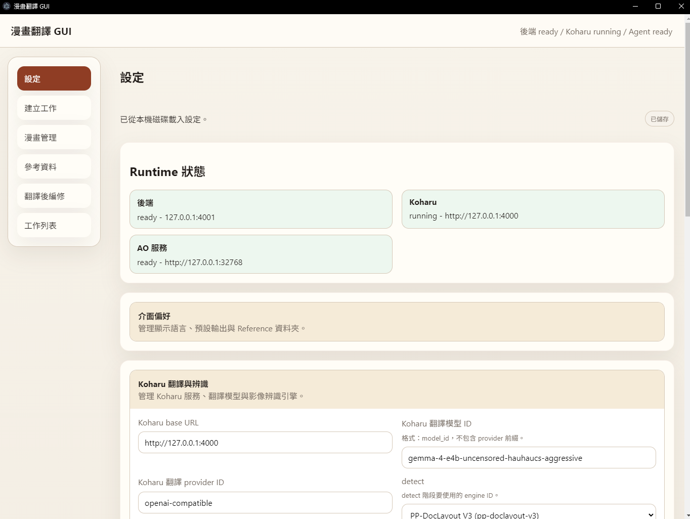
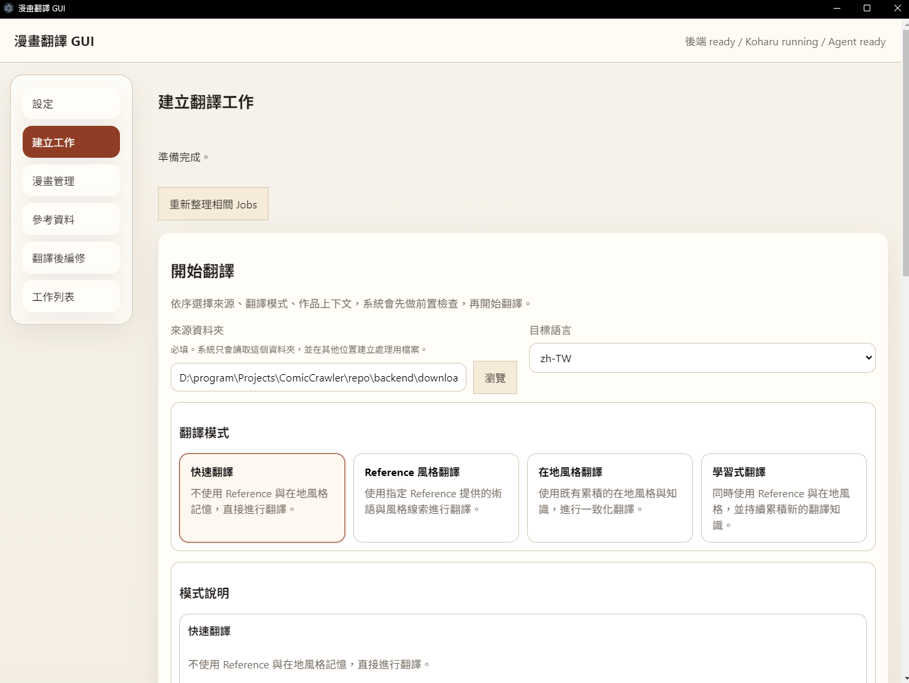
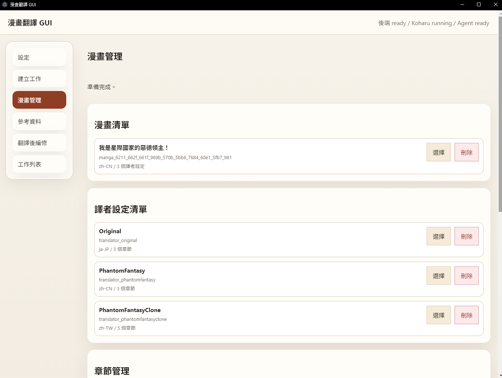
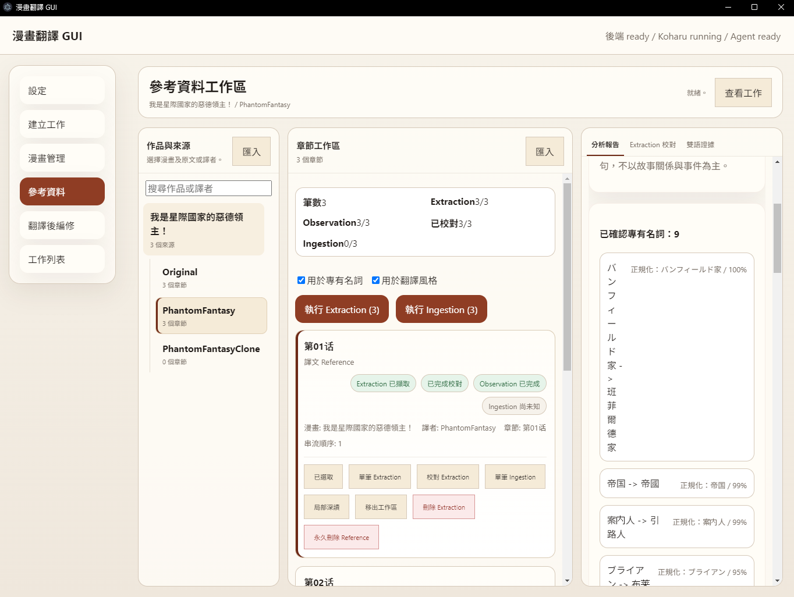
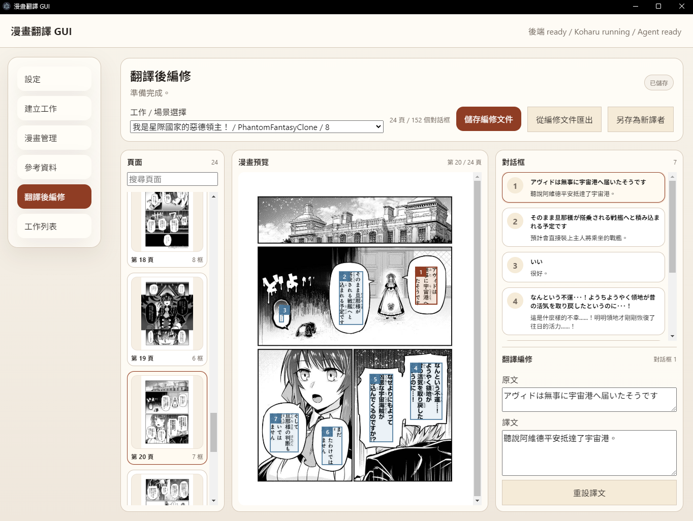
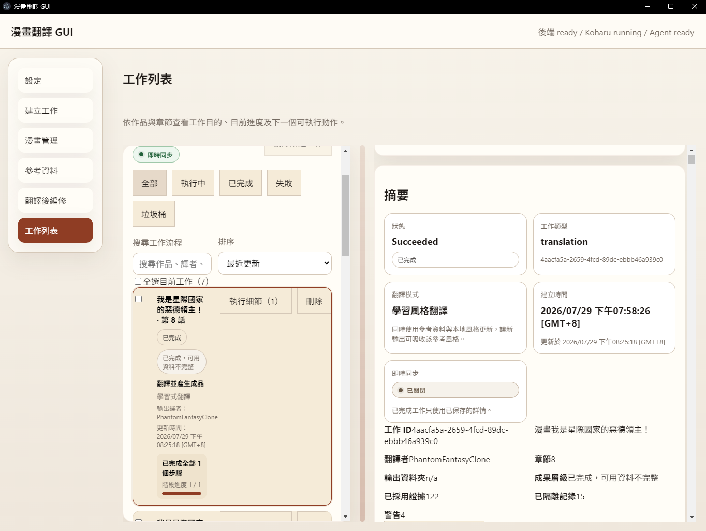

# Manga Translation Process Backend

This repository now centers on a process-trigger backend for Koharu-based manga translation.

## Main Entry

```bash
node backend/server.js
```

## Docker Backend

The backend can run as a standalone Linux container while AO and Koharu remain external HTTP services:

```bash
docker compose -p manga-backend up -d --build
curl http://127.0.0.1:4001/health
curl http://127.0.0.1:4001/ready
```

See `docs/DOCKER_BACKEND.md` for persistence, external-service addressing, browser CORS, authentication, and operational details.

After host Koharu is available, `scripts/rest_translation_workflow.mjs` exercises the complete REST lifecycle from image upload through artifact download. See `docs/REST_WORKFLOW.md`.

## GUI Startup

Release installers support both an existing REST backend and a bundled local-process fallback.
Docker remains the preferred always-on backend:

```bash
docker compose -p manga-backend up -d --build
```

The packaged GUI first connects to the configured backend address (default
`http://127.0.0.1:4001`). When it is unavailable, the GUI starts its bundled backend with its
bundled Node 24 runtime. Koharu and AO remain separate services; provider credentials and user data
are not embedded in the installer.

For repository development, the GUI can manage backend startup automatically.

For normal desktop usage:

```bash
cd gui
npm run preview
```

Startup behavior:
- if the configured backend is running, the GUI connects without changing that process
- otherwise Electron starts the bundled/local `backend/server.js` as a local-process fallback
- packaged releases include the backend source and a compatible Node 24 runtime
- closing the GUI stops only the local-process backend started by that GUI session
- closing the GUI does not stop an externally started backend
- Settings exposes separate Backend API and Koharu API addresses; backend-address changes apply on restart
- Settings stores an optional host `koharu.exe` path and auto-start preference in the GUI user-data file
- on startup, the GUI first checks `http://127.0.0.1:4000`; when unavailable and auto-start is enabled,
  it starts the configured executable in headless mode on port `4000`
- if backend `/ready` still reports Koharu unavailable, the GUI retries a saved auto-start executable once
  and then opens a recovery dialog where the user can choose `koharu.exe` or confirm manual startup
- the recovery dialog can download the official Koharu `0.61.2` Windows x64 standalone executable;
  it reuses a valid native-backend managed copy when one already exists
- choosing an executable from the recovery dialog saves its path, enables auto-start, starts Koharu, and
  keeps polling backend readiness until Koharu-backed jobs are unblocked
- closing the GUI stops only the Koharu process started by that GUI session, never an existing external service

Runtime requirement:
- the backend uses Node built-in `node:sqlite`
- backend startup must use a real Node runtime
- if backend is launched with the wrong executable, you may see `no such built-in module sqlite`

Install dependencies, validate, and build the repository GUI with:

```bash
npm ci --prefix gui
npm --prefix gui run typecheck
npm --prefix gui run build
```

`build` writes the Electron and renderer bundles to `gui/dist`; it does not update an installed copy.
Create the Windows installer and portable ZIP with Node 24+ on Windows:

```bash
npm --prefix gui run package
```

Release artifacts are written to `gui/release`. The package command embeds the current Windows Node
24 runtime for the local-process backend, builds the GUI, and produces both NSIS `.exe` and portable
`.zip` targets. Existing installed copies must be reinstalled from the new package to receive code
changes. See `docs/BUILD_AND_PACKAGE.md` for requirements, output names, verification, and the separate
Docker build procedure.

## Uninstall And User Data

For an installed Windows build, open **Settings → Apps → Installed apps**, find **Koharu Manga
Agent**, and choose **Uninstall**. For the portable ZIP, close the application and delete the extracted
folder.

The Windows installer registers `Uninstall Koharu Manga Agent.exe` and exposes it through
**Settings → Apps → Installed apps**. The assisted uninstaller includes an optional, unchecked
checkbox to delete application-owned user data. Without that checkbox, uninstalling preserves:

- GUI preferences: `%APPDATA%\manga-translation-gui\gui-settings.json`
- GUI-managed Koharu: `%LOCALAPPDATA%\Koharu Manga Agent\gui\koharu-runtime\<version>\koharu.exe`
- Native backend configuration: `%APPDATA%\Koharu Manga Agent\backend\koharu.json`
- Native backend data: `%LOCALAPPDATA%\Koharu Manga Agent\backend`
- Docker backend data and configuration: the `manga-backend_backend-data` named volume

The uninstaller provides two unchecked cleanup levels:

- **Application data** removes GUI preferences, GUI-managed Koharu, and native backend config/data.
- **ALL local data** additionally removes `%LOCALAPPDATA%\Koharu` projects/models and attempts to
  remove the `manga-backend-backend-1` container and `manga-backend_backend-data` Docker volume.

Both options are irreversible. The full cleanup deliberately does not recursively delete the GUI's
selected output/reference folders because those can be broad user-owned locations such as Downloads
and may contain unrelated files. Exported files outside application-owned roots must be reviewed and
deleted by the user; this prevents an uninstall checkbox from erasing an entire shared folder.

`docker compose -p manga-backend down` removes only the container and network. Adding `-v` also
deletes the named volume and all backend jobs, Knowledge, Reference data, uploads, and exports; use it
only when permanent data removal is intended.

## GUI Pages

The GUI currently exposes the following main pages through the left navigation.
Screenshot placeholders are reserved under `docs/images/`; replace each file with
the matching page capture when screenshots are ready.

| Page | Function Description | Screenshot Placeholder |
| --- | --- | --- |
| Settings | Configure runtime language, output/reference folders, AO connection, quality and translation models, Koharu base URL, Koharu runtime controls, engine selections, and path validation. |  |
| Create Job | Create translation jobs from a source folder, choose target language and translation mode, bind manga/translator/chapter metadata, configure Reference usage, quality checks, local style update, and run source preflight before starting. |  |
| Manga Management | Manage manga records, translator profiles, chapters, chapter titles, chapter ordering, and cascade deletion of manga, translators, or chapters with related Reference, Knowledge, Post Edit, and job data. |  |
| Reference | Import translated manga folders as Reference material, bind folders to manga/translator/chapter usage, run Extraction or Ingestion, inspect Reference jobs, review Extraction results, compare bilingual evidence, read Ingestion reports, and edit Reference artifacts. |  |
| Post Edit | Select translated jobs with post-edit documents, load translated page images through the backend REST API, browse page order and bubble/node order, edit original/translated text pairs, save edits, reset translations, and export corrected results. |  |
| Job List | Monitor current and trashed jobs with live SSE sync and polling fallback, filter/search/sort work, inspect selected-job details and workflow stages, retry/cancel/delete/restore/purge jobs, and review progress, warnings, timeline events, and result paths. |  |

## Backend API
- `POST /jobs/translation`
- `POST /jobs/reference-extraction`
- `POST /jobs/reference-ingestion`
- `GET /jobs/stream`
- `GET /jobs/:jobId`
- `GET /jobs/:jobId/stream`
- `POST /jobs/:jobId/retry`
- `POST /jobs/:jobId/cancel`
- `GET /ready` for dependency-aware readiness and capability reporting
- `GET /config`
- `GET /knowledge/:mangaId/glossary`
- `GET /knowledge/:mangaId/style-profile`
- `GET /knowledge/:mangaId/story-context`

## Runtime Shape
- local HTTP backend for future CLI and GUI clients
- workflow engine inside the process
- AO API is the only LLM execution boundary for quality and knowledge tasks
- AO task stages record `import_manifest.json` and `export_manifest.json`
- AO conversations are created per stage, initialized over HTTP, polled until `ready=true`, then used for task messages
- each agent stage records `import_manifest.json` and `export_manifest.json`
- Koharu HTTP API remains the external execution target

AO integration notes:
- all AO interactions go through the AO HTTP API
- AO runtime assets live under `backend/ao/`
- `backend/ao/opencode/opencode.json` is uploaded into each AO workspace before `start`
- backend polls `GET /api/conversations/:id` until `ready=true` before `POST /api/conversations/:id/message`

## Backend Data Layout
Reference data lives beneath the configured Backend data root:

```text
domains/reference/
|- images/<reference_set_id>/
|- extraction/<reference_set_id>/
|- comparisons/<reference_set_id>/
`- manifests/<reference_set_id>.json
```

The `comparisons/` subtree contains optional diagnostic output only.
The formal quality-stage result is the read-only `quality_validation_report` artifact written by the backend.

Reference images are imported through the Backend API and stored under:

```text
domains/reference/images/<reference_set_id>/
```

Then extract the reference set through the backend:

```http
POST /jobs/reference-extraction
Content-Type: application/json

{
  "referenceSetId": "ref_001"
}
```

If the provided images are actually AVIF files with misleading extensions, convert them first:

```bash
node backend/scripts/convert_reference_images.js --reference-set-id ref_001
```

## Knowledge Base Design
Knowledge artifacts live under:
- `domains/knowledge/self/default.json`
- `domains/knowledge/reports/extract_report.json`
- `domains/knowledge/index.json`

For manga-scoped knowledge storage, translation jobs may provide:
- `translationMode` (required)
- `mangaId`
- `mangaLabel`
- `translatorId`
- `chapterId`
- `sourceChapterId`
- `glossaryMode`

Translation jobs never run Reference Ingestion. Reference and learning modes compose completed
Reference assets and self-learning data into an immutable Translation Memory snapshot. Local and
learning modes schedule Knowledge as a non-blocking child after the corrected final snapshot is exported.

Reference ingestion promotes extracted reference text into reusable manga-scoped assets:
- `domains/knowledge/self/<mangaId>/canonical_glossary.json`
- `domains/knowledge/self/<mangaId>/story_context.json`
- `domains/knowledge/self/<mangaId>/style_profile.json`

## AO Runtime Assets
- `backend/ao/AGENTS.md`
- `backend/ao/agents/*`
- `backend/ao/skills/*`
- `backend/ao/opencode/opencode.json`

These are uploaded into each AO conversation workspace at runtime.

## Important Config
Native backend configuration is stored outside the repository. On Windows the default is
`%APPDATA%\Koharu Manga Agent\backend\koharu.json`; Docker stores it in the persistent `/data`
volume. `MANGA_TRANSLATION_CONFIG_PATH` can override the location.

Important fields:
- `api.baseUrl`
- `llm.defaultModel`
- `timeouts.*`
- `paths.*`
- `defaults.targetLanguage`
- `defaults.exportFormat`
- `engines.*`

## Tests
```bash
npm test --prefix tests
npm run test:unit --prefix tests
npm run test:integration --prefix tests
npm run test:e2e --prefix tests
npm run test:coverage --prefix tests
```

AO-runtime specific coverage now includes:
- AO HTTP client polling and message dispatch
- AO asset zip packaging and upload preparation
- quality optimization and knowledge enrichment result validation

## Design Docs
- `docs/ARCHITECTURE.md`
- `docs/API.md`
- `docs/WORKFLOW.md`
- `docs/SRS.md`
- `docs/STD.md`
- `docs/AGENT_INTEGRATION.md`
- `docs/GUI_SPEC.md`
- `docs/GUI_IA_UX.md`
- `docs/JOB_DETAIL_SPEC.md`
- `docs/E2E_MATRIX.md`
- `docs/BUILD_AND_PACKAGE.md`
- `docs/GUI_SCAFFOLD_PLAN.md`
- `docs/GUI_SMOKE_CHECKLIST.md`
- `docs/QUALITY_KNOWLEDGE_REFERENCE_SPEC.md`

GUI design notes:
- `docs/GUI_SPEC.md` captures the formal v1 screen and state requirements
- `docs/GUI_IA_UX.md` captures the user-first page, pane, tab, and scroll strategy
- `docs/JOB_DETAIL_SPEC.md` captures the selected-job workspace and progress presentation model
- `docs/E2E_MATRIX.md` captures the mixed local-environment e2e inventory, gate levels, and automated/manual/hybrid coverage split
- `docs/BUILD_AND_PACKAGE.md` documents GUI development builds, Windows installer and portable ZIP packaging, release outputs, and the separate Docker image build
- `docs/QUALITY_KNOWLEDGE_REFERENCE_SPEC.md` captures the new target responsibility split between upstream reference assets, long-term knowledge accumulation, and read-only quality validation
- the current GUI direction treats artifacts as job-scoped detail tabs inside `Job List`
- the current `Job List` workspace includes terminal-job delete-to-trash, restore/undo protection, permanent delete from Trash, checkbox batch actions, filtering, keyword search, sorting controls, and a collapsible/resizable list pane
- trashed jobs are automatically cleaned after the configured retention window (default: 30 days)
- file cleanup covers `logs`, translated output, job workspaces, and post-edit documents via `GET /maintenance/cleanup/preview` and `POST /maintenance/cleanup` (dry-run by default in preview, scheduled run hourly when `cleanup.enabled` is true); see `docs/API.md`
- `Job List` now uses `GET /jobs` for initial hydrate and `GET /jobs/stream` as the primary live sync channel, with fallback polling only when SSE is unavailable
- the `Job List` header shows a live-sync badge so users can tell whether list updates are flowing live, reconnecting, or falling back to polling
