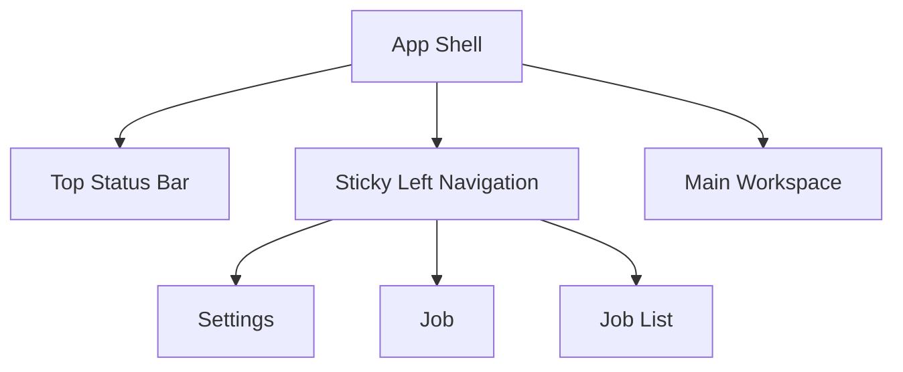
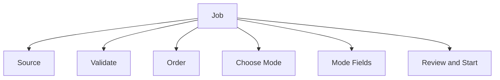
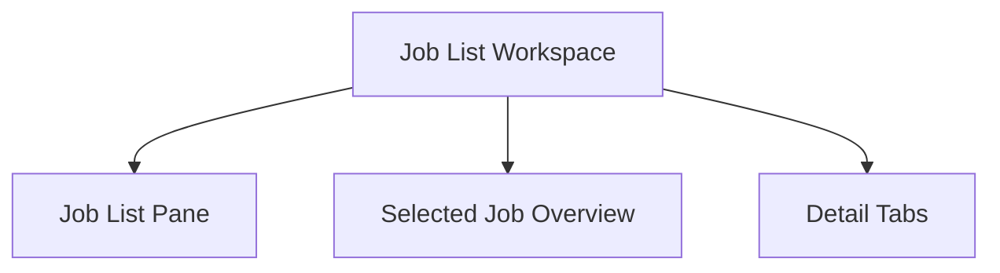
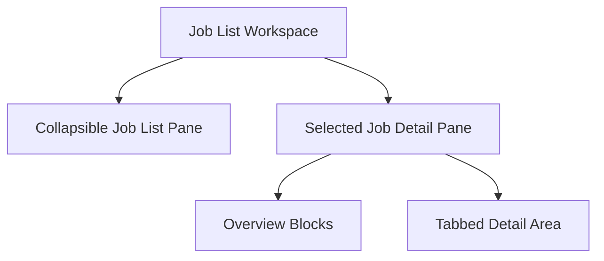

# GUI IA and UX Layout Specification

## Purpose
This document defines the intended information architecture and layout behavior of the desktop GUI from a user-first perspective.

The goal is not only to expose backend features, but to make the workflow easy to understand and efficient to use without forcing the user to:
- remember internal IDs
- jump between too many pages
- scroll through very long screens
- read raw event payloads to understand progress

## Design Principles
- one page should serve one primary user goal
- always-visible information should be limited to high-value status
- large or low-frequency information should move into tabs, panels, or collapsible areas
- raw logs and debug payloads must never dominate the main experience
- sticky panels are preferred over long vertical pages when content must remain visible

## Top-Level Navigation
The recommended top-level navigation is:
- `Settings`
- `Job`
- `Reference`
- `Job List`

The GUI should not use these as primary navigation items:
- `Job Detail`
- `Artifacts`

Reason:
- `Job Detail` is not a standalone user task; it is the detail workspace of a selected job
- `Artifacts` are currently job-scoped and are better represented as a detail tab inside the selected job workspace

## Page Responsibilities

### Settings
Primary goal:
- manage global defaults and runtime configuration

Should contain:
- output folder
- optional reference folder
- agent provider settings
- quality LLM settings
- translation LLM settings
- Koharu base URL
- pipeline engine settings

Should not contain:
- source folder
- manga title
- chapter title
- reference set name

### Job
Primary goal:
- create a new job in a guided, low-confusion flow

This page should not show:
- long job history
- selected job detail
- artifact browsing
- standalone reference extraction and ingestion controls

### Reference
Primary goal:
- manage reference preparation and inspection separately from translation-job creation

This page should contain:
- reference extraction
- OCR / extracted text review before ingestion
- reference ingestion
- OCR / extracted text preview
- JSON edit / save / delete for extracted outputs
- ingestion report preview
- translation context preview for the selected ingestion job

### Job List
Primary goal:
- inspect existing jobs
- select one job
- inspect its progress, result, and outputs

This page should contain:
- job list
- selected job detail
- job-scoped artifacts

## Layout Strategy

### Global App Shell
The app should use:
- sticky left navigation
- collapsible left navigation
- top status bar
- one primary work area

### Sticky Navigation Rules
The left navigation should:
- remain visible while the user scrolls
- not require the user to scroll back to the top to switch tasks
- stay compact and stable
- support collapse and expand

It should not contain:
- one-off detail pages
- context-sensitive items that only make sense after selection

Recommended states:
- expanded
  - icon + label
- collapsed
  - icon only

Persisted layout state should include:
- whether the left navigation is collapsed
- whether the job-list pane is collapsed
- the last known job-list pane width
- the last selected detail tab

## Job Page UX
The `Job` page should use a guided, staged layout rather than one long mixed form.

Recommended structure:

1. `Source`
2. `Validate`
3. `Order`
4. `Choose Mode`
5. `Mode Fields`
6. `Review and Start`

### Source
Contains:
- source folder
- browse
- read-access validation state

### Validate
Contains:
- discovered count
- accepted count
- converted count
- rejected count
- validate action
- validation/remediation feedback

### Order
Contains:
- image preview grid
- drag-drop ordering
- changed vs unchanged ordering summary
- apply order action

### Choose Mode
The user should choose a user-facing translation mode instead of combining internal backend switches.

Recommended modes:
- `快速翻譯`
- `參考風格翻譯`
- `本地風格翻譯`
- `學習風格翻譯`

The UI should not force the user to understand internal terms such as:
- `reference`
- `knowledge`
- `quality`

### Mode Fields
After a mode is selected, only the fields required by that mode should appear.

Always-visible fields:
- manga title
- optional chapter title

Mode-specific fields:
- `快速翻譯`
  - no extra style-related controls
- `參考風格翻譯`
  - `參考資料`
  - optional `在翻譯前更新參考資料`
  - optional `參考術語策略`
  - optional consistency-check control
- `本地風格翻譯`
  - optional consistency-check control
- `學習風格翻譯`
  - `參考資料`
  - optional `在翻譯前更新參考資料`
  - optional `參考術語策略`

Internal mapping note:
- `參考風格翻譯` = use reference assets without writing local style memory
- `本地風格翻譯` = write local style memory without external reference input
- `學習風格翻譯` = use reference assets, write local style memory, and run quality validation

### Review and Start
Contains:
- preflight summary
- output folder summary
- generated IDs preview
- checklist
- blocking issues
- start translation action

This is the only place where the primary `Start translation` action should appear.

Recommended running text by mode:
- `快速翻譯中...`
- `參考 {referenceLabel} 風格翻譯中...`
- `使用本地風格翻譯中...`
- `學習 {referenceLabel} 風格翻譯中...`

Recommended secondary stage text:
- `整理本地風格中...`
- `檢查風格一致性中...`

## Job List Workspace UX
`Job List` should be a dedicated job-inspection workspace, not a plain list page.

Recommended layout:
- left pane: job list
- center pane: selected job overview
- right pane: detail tabs

If the display is too narrow, the center and right panes may stack vertically.

### Panel Behavior
The `Job List` workspace should support panel-based layout controls so users do not need to rely on long vertical scrolling.

Recommended panel behavior:
- left navigation can collapse/expand
- job list pane can collapse/expand
- boundary between job list and detail should be resizable
- detail tabs remain the preferred home for large secondary content

State that should persist locally:
- whether left navigation is collapsed
- whether job list pane is collapsed
- last known job list pane width
- last selected detail tab

This allows the workspace to reopen in a familiar shape instead of forcing users to re-expand or re-size the same working areas every time.

### Left Pane: Job List
Should include:
- current jobs
- recent jobs
- search
- filter
- sort
- retry
- stop

This pane should be scrollable independently from the rest of the page.

### Center Pane: Selected Job Overview
This pane should stay focused on high-value status information:
- summary
- workflow overview
- pipeline engine status
- page progress
- warning/error summary

Recommended presentation:
- summary cards
- workflow cards
- engine cards
- a page-progress hero card

This pane should be visible without opening tabs.

### Right Pane: Detail Tabs
Recommended tabs:
- `Preflight`
- `Artifacts`
- `Reference / Knowledge`
- `Raw Events`

This keeps the page from becoming one extremely long vertical document.

## Job Detail Presentation
The selected-job detail should be split into:

### Always-visible summary blocks
- `Job Summary`
- `Workflow Overview`
- `Pipeline Engines`
- `Page Progress`

These blocks should not be hidden behind collapses by default.

### Tabbed detail blocks
- `Preflight`
- `Artifacts`
- `Reference / Knowledge`
- `Raw Events`

This keeps the working surface readable and avoids forcing users to scroll through everything every time.

## What Should Be Sticky
Recommended sticky areas:
- left navigation
- top status bar
- if practical, the selected-job overview header inside `Job List`

Not recommended as sticky:
- raw event log
- artifact preview bodies
- large preflight image grids

## What Should Be Collapsible
Good candidates for collapse:
- settings sections
- left navigation
- job list pane
- generated identifiers
- rejected-file full lists
- reference/knowledge secondary settings
- raw payload blocks
- raw event details

Not good candidates for collapse:
- current status
- workflow overview
- pipeline engines
- page progress
- blocking issues

## Artifact Placement Policy
In the current model, artifacts are job-scoped.

Therefore:
- artifacts should be shown from the selected job context
- they should live inside the `Job List` workspace as a detail tab
- they do not need to be a top-level page in v1

This means the user flow is:
1. open `Job List`
2. select a job
3. inspect artifacts from that selected-job workspace

If the user has not selected a job yet, the GUI should prefer an empty-state prompt rather than pretending that artifacts can be browsed without context.

If a future cross-job artifact library is introduced, it can become a separate page later.

## Scrolling Rules
To reduce fatigue:
- avoid one giant page with all sections expanded
- prefer independent pane scrolling
- prefer tabs over endless vertical stacking
- prefer summaries first, raw details later

Specific recommendations:
- job list pane scrolls independently
- raw event log scrolls independently
- image ordering grid scrolls independently if long
- the app should not force the user to wheel-scroll through every section to reach artifacts or logs

## Notification Strategy
Important actions should produce center-screen transient notices:
- validation start/success/failure
- start translation
- create job success/failure
- apply order success/failure

These notices should not replace stable inline status, but they should acknowledge major user actions immediately.

## Current Recommended Final Structure

### Top Navigation
- `Settings`
- `Job`
- `Job List`

### Job Page
- source selection
- validation
- ordering
- translation mode selection
- mode-specific fields
- review and start

### Job List Page
- job list pane
- selected job overview pane
- detail tabs:
  - preflight
  - artifacts
  - reference/knowledge
  - raw events

Layout behavior:
- sticky left navigation
- collapsible left navigation
- collapsible or resizable job list pane
- selected job detail prioritized over raw logs

## Implementation Priority
1. align docs and IA
2. stabilize top-level page structure
3. split `Job` and `Job List`
4. move artifacts into `Job List` detail tabs
5. add workflow / engine / page-progress summary blocks
6. keep raw events as a debug tab, not the main view
