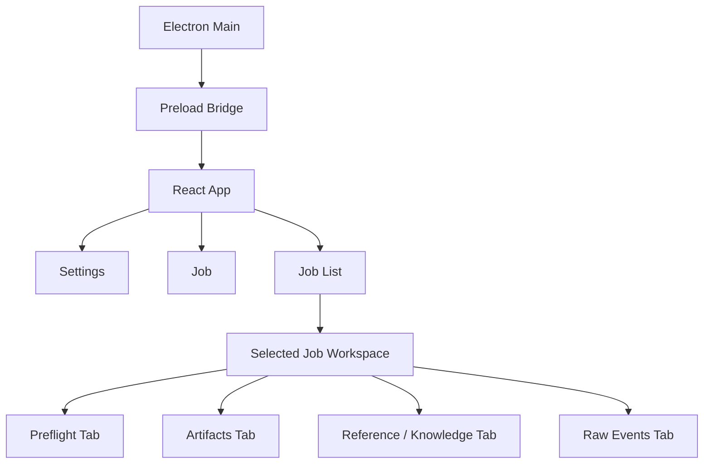

# GUI Scaffold Plan

## Purpose
This document defines the initial project skeleton for the desktop GUI.

It answers:
- where GUI code should live
- how Electron and React should be split
- what files should exist on day one
- what the first implementation slices should produce

This is a scaffold plan, not the final UI behavior spec.
Behavior and product requirements remain in:
- `docs/GUI_SPEC.md`

## Goals
- create a stable desktop shell without disturbing the current backend
- keep GUI code isolated from backend runtime code
- make it easy to add settings, job creation, selected-job workspaces, and interaction tracing incrementally
- preserve a clear boundary between Electron main process and React renderer

## Non-Goals
- building the full GUI in one step
- embedding the backend into the renderer
- replacing the backend HTTP API with direct in-process calls
- implementing glossary editors in the first scaffold pass

## Top-Level Repository Placement
The GUI should live as a new top-level workspace:

```text
comics/1/
|- backend/
|- docs/
|- gui/
|- tests/
`- ...
```

Rationale:
- keeps desktop concerns separate from backend runtime code
- avoids mixing React build outputs with backend source
- makes packaging and release logic easier later

## GUI Workspace Shape
Recommended initial structure:

```text
gui/
|- package.json
|- electron.vite.config.js
|- tsconfig.json
|- src/
|  |- main/
|  |  |- index.ts
|  |  |- windows/
|  |  |  `- main_window.ts
|  |  |- services/
|  |  |  |- backend_process.ts
|  |  |  |- settings_store.ts
|  |  |  `- shell_paths.ts
|  |  `- ipc/
|  |     |- channels.ts
|  |     `- handlers.ts
|  |- preload/
|  |  `- index.ts
|  `- renderer/
|     |- index.html
|     |- main.tsx
|     |- app/
|     |  |- App.tsx
|     |  |- routes.tsx
|     |  `- providers.tsx
|     |- pages/
|     |  |- SettingsPage.tsx
|     |  |- JobsPage.tsx
|     |  `- JobListPage.tsx
|     |- components/
|     |  |- layout/
|     |  |- jobs/
|     |  |- detail/
|     |  |- interaction/
|     |  `- settings/
|     |- features/
|     |  |- settings/
|     |  |- jobs/
|     |  |- events/
|     |  `- detail_tabs/
|     |- stores/
|     |  |- ui_store.ts
|     |  `- interaction_store.ts
|     |- api/
|     |  |- client.ts
|     |  |- jobs.ts
|     |  |- runtime.ts
|     |  `- knowledge.ts
|     |- stream/
|     |  `- job_stream.ts
|     `- styles/
|        |- tokens.css
|        `- app.css
`- dist/
```

## Process Boundary

### Electron Main Process
Owns:
- app lifecycle
- browser window lifecycle
- local settings file path resolution
- optional backend child-process lifecycle
- safe IPC bridge
- opening artifact folders in the OS shell

Must not own:
- job rendering logic
- backend job state
- business-level workflow decisions

### Preload
Owns:
- narrow secure bridge from renderer to Electron main
- typed IPC surface

Must expose only the minimum needed operations:
- read local settings
- write local settings
- open folder or file in OS shell
- query desktop-only runtime metadata

### React Renderer
Owns:
- routes
- views
- form state
- stream state
- job list and selected-job workspace presentation
- interaction panel behavior

Must not directly access:
- Node filesystem APIs
- child-process APIs
- unrestricted shell execution

## Settings Ownership

### GUI-Owned Settings File
The GUI should maintain its own local settings file.

Recommended filename:
- `gui-settings.json`

Recommended fields:
- `schemaVersion`
- `updatedAt`
- `outputFolder`
- `referenceFolder`
- `agent`
- `quality`
- `translation`
- `koharu`
- `engines`
- `lastSelectedPage`
- `lastSelectedJobId`
- `lastSelectedMangaId`

The settings file should live in the desktop app data directory, not in repo root.

### Backend Config Relationship
The GUI should not overwrite `.opencode/koharu.json` directly as its primary persistence model.

Instead:
- GUI settings are local user defaults
- each job payload is created from GUI settings
- backend continues to resolve final config through its existing rules

## Renderer State Plan

### React Query
Use for:
- `GET /health`
- `GET /config`
- `GET /jobs`
- `GET /jobs/:jobId`
- `GET /jobs/:jobId/events`
- `GET /jobs/:jobId/artifacts`
- `GET /runtime/status`
- knowledge asset fetches

### Zustand
Use for:
- selected job id
- selected manga id
- selected page
- interaction filters
- auto-follow enabled or disabled
- unread event count
- expanded trace rows

### Local Component State
Use for:
- form input drafts
- dialog visibility
- inline validation messages

## API Client Plan
The GUI should centralize HTTP access in:
- `src/renderer/api/client.ts`

Recommended responsibilities:
- base URL resolution
- JSON fetch helpers
- timeout defaults
- typed response parsing
- standard error normalization

Then feature-level files wrap specific domains:
- `jobs.ts`
- `runtime.ts`
- `knowledge.ts`

## Stream Client Plan
The GUI should centralize live event logic in:
- `src/renderer/stream/job_stream.ts`

Responsibilities:
- connect to SSE endpoint
- reconnect with backoff
- expose parsed event objects
- support unsubscribe
- de-duplicate by `eventId`

The stream client should not mutate React state directly.
It should publish events to the relevant store or React Query cache updater.

## First Scaffold Files
The first scaffold pass should create at least:

### Workspace and Build
- `gui/package.json`
- `gui/tsconfig.json`
- `gui/electron.vite.config.js`

### Main Process
- `gui/src/main/index.ts`
- `gui/src/main/windows/main_window.ts`
- `gui/src/main/services/settings_store.ts`
- `gui/src/main/services/shell_paths.ts`

### Preload
- `gui/src/preload/index.ts`

### Renderer
- `gui/src/renderer/main.tsx`
- `gui/src/renderer/app/App.tsx`
- `gui/src/renderer/app/routes.tsx`
- `gui/src/renderer/app/providers.tsx`
- `gui/src/renderer/pages/SettingsPage.tsx`
- `gui/src/renderer/pages/JobsPage.tsx`
- `gui/src/renderer/pages/JobListPage.tsx`
- `gui/src/renderer/api/client.ts`
- `gui/src/renderer/stream/job_stream.ts`
- `gui/src/renderer/stores/ui_store.ts`
- `gui/src/renderer/stores/interaction_store.ts`
- `gui/src/renderer/styles/tokens.css`
- `gui/src/renderer/styles/app.css`

## First Visible Milestone
The first milestone should prove the shell works without building full job control.

Definition of done:
- Electron window launches
- React renderer loads
- settings file can be read and written
- backend health status can be fetched
- jobs page can render a placeholder list from snapshot API

## Milestone Plan

### Milestone 1: Shell
- initialize Electron workspace
- launch a single main window
- mount React app
- wire preload bridge

### Milestone 2: Settings and Health
- local settings persistence
- settings page
- runtime health badges
- path validation

### Milestone 3: Jobs Snapshot
- job creation page
- job list workspace
- fetch current job snapshot

### Milestone 4: Live Traces
- SSE stream client
- interaction panel
- auto-follow and jump-to-latest behavior

### Milestone 5: Job Creation and Control
- translation mode form
- reference extraction form
- reference ingestion form
- stop and retry
- selected-job detail tabs and artifact opening

## Backend Dependencies
Before the GUI reaches Milestone 3 or later, the backend should expose:
- `GET /jobs`
- `GET /jobs/:jobId/events`
- `GET /jobs/:jobId/artifacts`
- `GET /runtime/status`

These are already called out in:
- `docs/GUI_SPEC.md`

## Narrow Layout Sketch


## Implementation Readiness
GUI implementation is ready to start once:
- this scaffold plan is accepted
- the missing GUI-friendly backend endpoints are confirmed
- the first workspace is created under `gui/`
