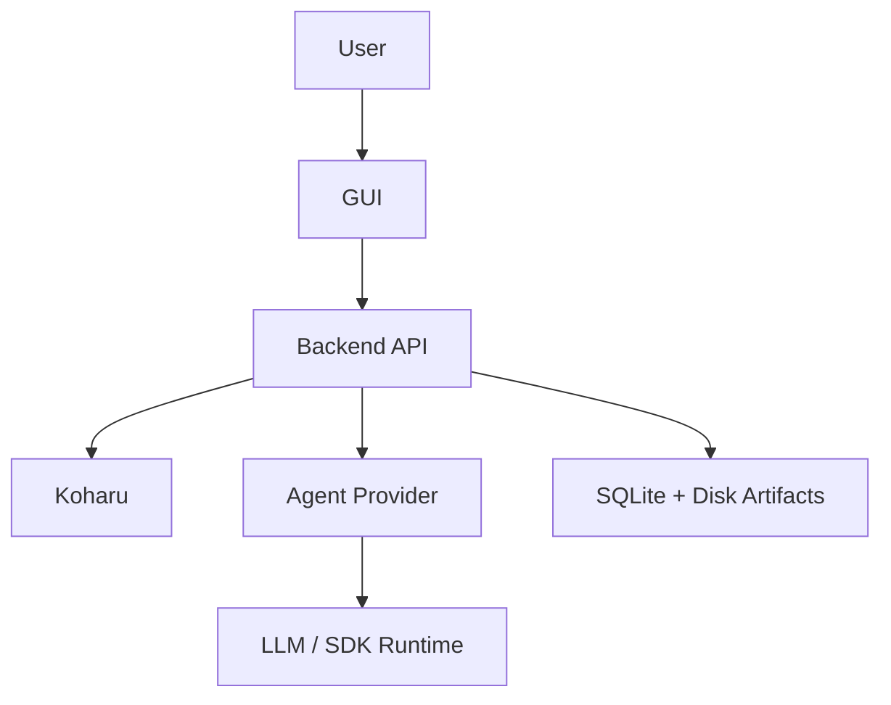

# GUI v1 Specification

## Purpose
This document defines the first formal GUI for the process-trigger manga translation backend.

The GUI is the primary user-facing control surface for:
- creating translation jobs
- managing reference extraction and ingestion workflows
- monitoring backend progress
- inspecting Process / Agent / LLM interactions
- reviewing exported artifacts
- managing local settings

The current page model is:
- `Settings`
- `Job`
- `Reference`
- `Job List`

Navigation note:
- `Artifacts` is currently treated as a selected-job detail section
- while artifacts remain job-scoped, they should not be treated as a required first-class primary task page

The GUI is not the source of truth for workflow state. The backend remains the owner of:
- job lifecycle
- stage progression
- event history
- knowledge artifacts
- workspace audit manifests

## Design Principles
- backend-owned state, UI-owned presentation
- settings must survive refresh and restart
- refresh must not interrupt running jobs
- the interaction view must support long-running scrollable traces
- the GUI must recover from reconnects without losing history
- the GUI must support future expansion to glossary and style editing
- panel-based layouts are preferred over long vertical pages
- collapsible and resizable panes should be used where they reduce scroll fatigue

## Runtime Relationship
The runtime is split into:
- backend process
- GUI client
- Koharu
- Agent provider runtime

### Backend Lifecycle Ownership
For normal desktop usage, Electron is responsible for backend startup.

Rules:
- if backend is already reachable, the GUI connects to it as `external`
- if backend is not reachable, Electron starts `node backend/server.js` as `managed`
- closing the GUI stops only a managed backend child process
- closing the GUI must not stop an externally started backend
- refresh inside the renderer must never interrupt backend work

### Node Runtime Requirement
The backend job store uses Node built-in `node:sqlite`.

Requirements:
- backend startup must use a real Node runtime
- the GUI-managed launcher must not use the Electron binary as a substitute for Node
- if the runtime does not support `node:sqlite`, startup may fail with `no such built-in module sqlite`

## Persistence Rules

### Local GUI Settings
All user settings must be stored locally.

Settings must not exist only in browser memory or transient UI state.

Minimum persistence requirements:
- save settings to local disk
- include `schemaVersion`
- include `updatedAt`
- load settings before UI initialization
- preserve settings across refresh
- preserve settings across full GUI restart

### Backend State
The backend must remain the owner of:
- active jobs
- completed jobs
- event stream history
- artifacts
- error records

Closing or refreshing the GUI must not stop backend execution.

### UI Recovery Model
When the GUI loads or reloads, it must:
1. load local settings
2. fetch backend snapshot state
3. reconnect to live stream
4. merge historical and live events without duplication

## Required Settings

### Global Settings
These are stored locally and reused by default for future jobs.

#### Source and Output
- `outputFolder`
  - required for usable translation jobs
  - default should be the current user Downloads folder
  - this becomes the explicit `outputDir` sent with translation and post-edit export jobs
- `referenceFolder`
  - optional
  - root folder for other translated chapters used for comparison

#### Agent Provider
- `agentProvider`
  - currently only `opencode`
- `opencode.runtime.mode`
  - `managed`
  - `external`
- `opencode.runtime.baseUrl`
  - required for `external`
- `opencode.runtime.commandDir`
  - required for `managed`
- `opencode.moduleName`
- `opencode.exportName`
- `opencode.timeoutMs`

#### Quality LLM
- `quality.enabled`
- `quality.modelId`
- `quality.serverUrl`
- `quality.apiKey` if required later

#### Translation LLM for Koharu
- `translation.modelId`
- `translation.serverUrl`

#### Koharu Connection
- `koharu.baseUrl`

#### Pipeline Engines
- `engines.detect`
- `engines.fontDetect`
- `engines.segment`
- `engines.bubbleSegment`
- `engines.ocr`
- `engines.translate`
- `engines.clean`
- `engines.render`

### Per-Job Settings
These must be visible and editable at job creation time.

- `sourceFolder`
  - required
  - no default value
  - must be readable
  - is used only for source discovery and preprocessing
- `mangaLabel`
  - required
  - selected from an existing manga list or entered through an inline `Create new manga` field
  - GUI generates `mangaId` automatically from the effective selected or newly entered manga title
- `chapterLabel`
  - optional
  - GUI generates `chapterId` automatically when present
- `translationMode`
  - required
  - one of:
    - `quick` (`快速翻譯`)
    - `reference_style` (`參考風格翻譯`)
    - `local_style` (`本地風格翻譯`)
    - `learning_style` (`學習風格翻譯`)
- `sourceChapterId`
  - optional override for source chapter matching in Reference-based modes
- `glossaryMode`
  - user-facing label: `Reference glossary strategy` / `參考術語策略`
  - shown only for reference-based modes
  - `canonical`
  - `reference_only`
  - `disabled`

### Translation Mode Mapping
The GUI should expose user-friendly translation modes instead of raw internal backend terms.

| Mode value | User label | Reference memory | Local memory | Quality | Knowledge update |
| --- | --- | --- | --- | --- | --- |
| `quick` | `快速翻譯` | no | no | no | no |
| `reference_style` | `參考風格翻譯` | yes | no | optional | no |
| `local_style` | `本地風格翻譯` | no | yes | optional | yes |
| `learning_style` | `學習風格翻譯` | yes | yes | required | yes |

The GUI should not expose raw internal labels such as `reference`, `knowledge`, or `quality` as the primary mode-selection vocabulary.

## Required Screens

### 1. Settings
Responsibilities:
- edit all global settings
- validate settings before save
- show current connectivity
- persist settings locally

Current v1 behavior:
- `sourceFolder` is not edited in `Settings`
- `Settings` owns the global `outputFolder`, optional `referenceFolder`, runtime settings, model settings, and engine settings
- saving writes directly to the real local GUI settings file
- there is no separate `Reload from disk` action in v1
- changing settings affects future jobs only

Required status indicators:
- backend reachable / unreachable
- Koharu reachable / unreachable
- agent runtime ready / degraded / unavailable
- quality LLM reachable / unreachable

### 2. Job
Responsibilities:
- create translation jobs
- validate source images before translation starts
- allow manual source-image ordering before translation starts
- start translation jobs from one focused creation workspace

### 3. Reference
Responsibilities:
- create reference extraction jobs
- create reference ingestion jobs
- capture an optional translator name for reference-preparation jobs
- inspect OCR / extracted reference outputs
- edit or delete extracted reference JSON files when operator review is needed
- preview ingestion artifacts such as glossary, story context, style profile, and translation context
- separate reference preparation from translation-job creation so OCR review happens before ingestion when needed

Current v1 translation form behavior:
- the page caches draft content while the user navigates to other pages
- `Browse` for `sourceFolder` remembers the last selected source directory
- `Start translation` stays disabled until:
  - `sourceFolder` is chosen
  - `mangaLabel` is entered
  - `outputFolder` is valid
  - source preflight succeeds
  - no relevant translation-job fields changed after the most recent validation
- while disabled, `Start translation` is gray and shows blocking reasons through hover text and an on-page checklist
- the `Validate` action is the required preflight entrypoint before translation
- the user first chooses a translation mode
- the form then reveals only the fields required by that mode
- the GUI sends the explicit `translationMode`; obsolete raw mode flags are not sent
- Reference modes show automatic source-chapter matching and an optional override
- the current GUI mode labels are:
  - `快速翻譯`
  - `參考風格翻譯`
  - `本地風格翻譯`
  - `學習風格翻譯`
- the current centered start-status wording is:
  - `快速翻譯中...`
  - `參考 {referenceLabel} 風格翻譯中...`
  - `使用本地風格翻譯中...`
  - `學習 {referenceLabel} 風格翻譯中...`

Mode-specific translation requirements:

| Mode | Goal | Required fields | Conditional fields | Running text |
| --- | --- | --- | --- | --- |
| `quick` / `快速翻譯` | complete this translation only, without reference-style input and without local-style updates | `sourceFolder`, `mangaLabel` | optional `chapterLabel` | `快速翻譯中...` |
| `reference_style` / `參考風格翻譯` | translate using completed Reference style and terminology without updating local memory | `sourceFolder`, manga/translator binding | optional `chapterLabel`, `sourceChapterId`, `glossaryMode`, optional Quality | `參考風格翻譯中...` |
| `local_style` / `本地風格翻譯` | translate using accumulated local style memory and write the new result back into local style memory | `sourceFolder`, `mangaLabel` | optional `chapterLabel`, optional quality validation | `使用本地風格翻譯中...` |
| `learning_style` / `學習風格翻譯` | use completed Reference and local memory, force Quality, then learn from the exported final snapshot | `sourceFolder`, manga/translator binding | optional `chapterLabel`, `sourceChapterId`, `glossaryMode` | `學習風格翻譯中...` |

Recommended secondary stage text:
- `更新本地風格中...`
- `執行品質驗證中...`

