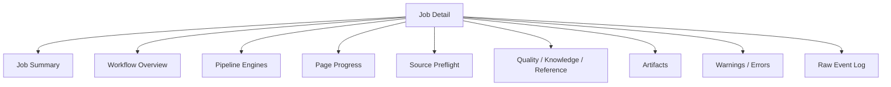
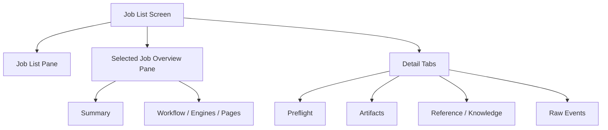
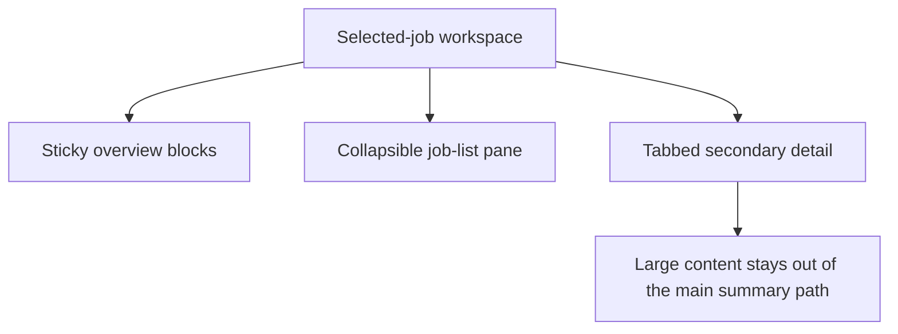

# Job Detail Specification

## Purpose
This document defines what the GUI must present for an individual job once the user selects it from `Job List`.

`Job Detail` is not a top-level navigation destination anymore.
It is a detail workspace embedded inside the `Job List` screen.

The purpose of `Job Detail` is to answer these user questions quickly:
- What is this job doing now?
- Which workflow stage is running?
- Which Koharu engine is currently active?
- How many manga pages are done?
- Did source preflight succeed?
- Did quality / knowledge / reference stages run?
- Where are the outputs and reports?
- What went wrong if the job failed?

## Design Principles
- summary first, raw events later
- workflow state and pipeline-engine state must be separated
- page progress must be visible without opening raw payloads
- repeated progress events must not flood the main detail view
- artifacts and errors must stay one click away

## Information Architecture
`Job Detail` must be structured in this order:

1. `Job Summary`
2. `Workflow Overview`
3. `Pipeline Engines`
4. `Page Progress`
5. `Source Preflight`
6. `Quality / Knowledge / Reference`
7. `Artifacts`
8. `Warnings / Errors`
9. `Raw Event Log`

## Job Summary
This is the fixed top section.

It must show:
- `jobId`
- `jobType`
- `status`
- `currentStage`
- `mangaTitle`
- `chapterTitle`
- `mangaId`
- `chapterId`
- `createdAt`
- `updatedAt`
- `sourceFolder`
- `outputFolder`

The user should be able to understand what the job is and whether it is still running in under a few seconds.

## Workflow Overview
This section represents the process/backend workflow rather than Koharu engines.

Required workflow stages:
- `source_preflight`
- `project_setup`
- `upload_pages`
- `start_pipeline`
- `pipeline_monitor`
- `quality`
- `knowledge`
- `export`
- `close_project`

Each stage must project into one of:
- `waiting`
- `running`
- `completed`
- `failed`
- `skipped`

This section should be compact and should not require reading raw event payloads.

## Pipeline Engines
This section represents Koharu pipeline work.

Required engine keys:
- `detect`
- `fontDetect`
- `segment`
- `bubbleSegment`
- `ocr`
- `translate`
- `clean`
- `render`

Each engine should show:
- `status`
- `startedAt`
- `updatedAt`
- optional progress summary

Each engine must project into one of:
- `waiting`
- `running`
- `completed`
- `failed`
- `skipped`

The GUI should prefer this view over dumping repeated `pipeline.progress` events.

## Page Progress
This section tracks manga-page progress rather than workflow stages.

Required fields:
- `totalPages`
- `completedPages`
- `currentPageIndex`
- `currentPageName`
- `currentEngine`

Preferred presentation:
- `12 / 45 pages`
- `current page: page_012`
- `current engine: translate`

If the backend does not yet provide exact page progress, the GUI may display:
- total pages from source preflight or scene summary
- last known current page if present
- `unknown` where the backend has no reliable value

## Source Preflight
This section should remain visible after translation starts because users often need to confirm what actually entered Koharu.

Required fields:
- `sourceFolder`
- `discoveredCount`
- `acceptedCount`
- `convertedCount`
- `rejectedCount`
- `orderChanged`
- `manifestPath`

Required lists:
- rejected files
- accepted image count
- converted image count

The original source folder must not be mutated in place; the detail view should point to staged artifacts instead.

## Quality / Knowledge / Reference
This section must show which optional stages were enabled and what they produced.

Required fields:
- `qualityEnabled`
- `knowledgeEnabled`
- `referenceEnabled`
- `referenceSetId`
- `glossaryMode`
- `qualityModelSummary`
- `knowledgeResultSummary`
- `qualityReportSummary`

If available, also show:
- which project knowledge inputs quality used
  - glossary
  - story context
  - style profile
  - accumulated project knowledge
- whether reference ingestion ran
- whether knowledge update wrote manga-scoped artifacts

## Artifacts
This section must provide quick access to outputs.

Required artifact groups:
- `export`
- `quality validation reports`
- `workspace manifests`
- `glossary`
- `story context`
- `style profile`
- `knowledge outputs`
- `source preflight manifest`

Legacy comparison reports may still appear when present, but they must be grouped as transitional diagnostics rather than the primary quality result.

Each artifact entry should show:
- `kind`
- `path`
- lightweight metadata
- `Open`
- optional `Preview`

## Warnings / Errors
This section should show non-terminal and terminal problems separately from raw event logs.

Examples:
- invalid source folder fixed after retry
- output folder unavailable
- fallback mode used for agent provider
- late-attach recovery occurred
- export failed
- quality stage failed

Required categories:
- `warning`
- `error`
- `recovered`
- `skipped`

## Raw Event Log
This is the debug section, not the main status view.

Rules:
- repeated consecutive events with the same `type + payload` should be collapsed in presentation
- the UI may show `xN` repetition counts
- raw JSON should remain expandable
- this section must not be the only place where the user can understand progress

## Data Sources
The detail view depends on three classes of data.

### 1. Job Snapshot
Primary source:
- `GET /jobs/:jobId`

Used for:
- summary
- current status
- payload
- result
- terminal error

### 2. Persisted Events
Primary source:
- `GET /jobs/:jobId/events`

Used for:
- workflow projection
- pipeline projection
- page-progress projection
- raw event log

### 3. Artifacts
Primary source:
- `GET /jobs/:jobId/artifacts`

Used for:
- export links
- quality validation report links
- legacy diagnostic links when present
- workspace manifest links
- source preflight manifest links
- knowledge / glossary / style links

## Current Backend Gaps
The current backend event model does not yet fully support the desired `Pipeline Engines` and `Page Progress` sections.

Currently available from `pipeline_monitor` progress callbacks:
- `operationId`
- `status`
- `progress`

Currently missing or not yet standardized:
- engine key
- engine status history
- current page index
- total page count inside progress events
- current page name
- current engine per page

Because of this, the GUI can currently:
- collapse duplicate progress events
- show scene-derived total pages when available
- show workflow state

But it cannot yet build a perfect engine/page progress model.

## Required Backend Event Model for Full Detail View
To complete the intended `Job Detail`, the backend should emit structured progress events such as:

```json
{
  "type": "pipeline.progress",
  "payload": {
    "operationId": "uuid",
    "engine": "translate",
    "engineStatus": "running",
    "currentPageIndex": 12,
    "totalPages": 45,
    "currentPageName": "page_012.png",
    "progress": 0.56
  }
}
```

The workflow layer should also emit structured stage events such as:

```json
{
  "type": "workflow.stage",
  "payload": {
    "stage": "quality",
    "status": "completed"
  }
}
```

## Recommended UI Layout
Use a narrow, vertical, readable layout.

The top of the selected-job workspace should favor card-based presentation rather than plain lists:
- summary cards for job identity and timing
- workflow status cards for backend stages
- engine status cards for Koharu pipeline steps
- a page-progress hero card for `completed / total`, `current page`, and `current engine`



For the job workspace itself:



For panel behavior:



## Current Implementation State
### Already Present
- summary
- payload
- result / error
- artifacts
- persisted event list
- repeated-event collapse in the detail log
- card-based workflow, engine, and page-progress overview
- warnings / errors cards
- a safer local-state live interaction panel inside the raw-events tab

### Partially Present
- workflow timeline
- source preflight visibility

### Not Yet Fully Implemented
- dedicated workflow overview model
- dedicated pipeline engine model
- dedicated page progress model
- warnings / recovered / skipped summary model
- structured agent / provider summary block

## Next Implementation Order
1. backend event-model enrichment for engine and page progress
2. frontend workflow overview projection
3. frontend pipeline-engine projection
4. frontend page-progress projection
5. warnings / recovery summary
6. optional reintroduction of live interaction view after the stable detail view is complete
