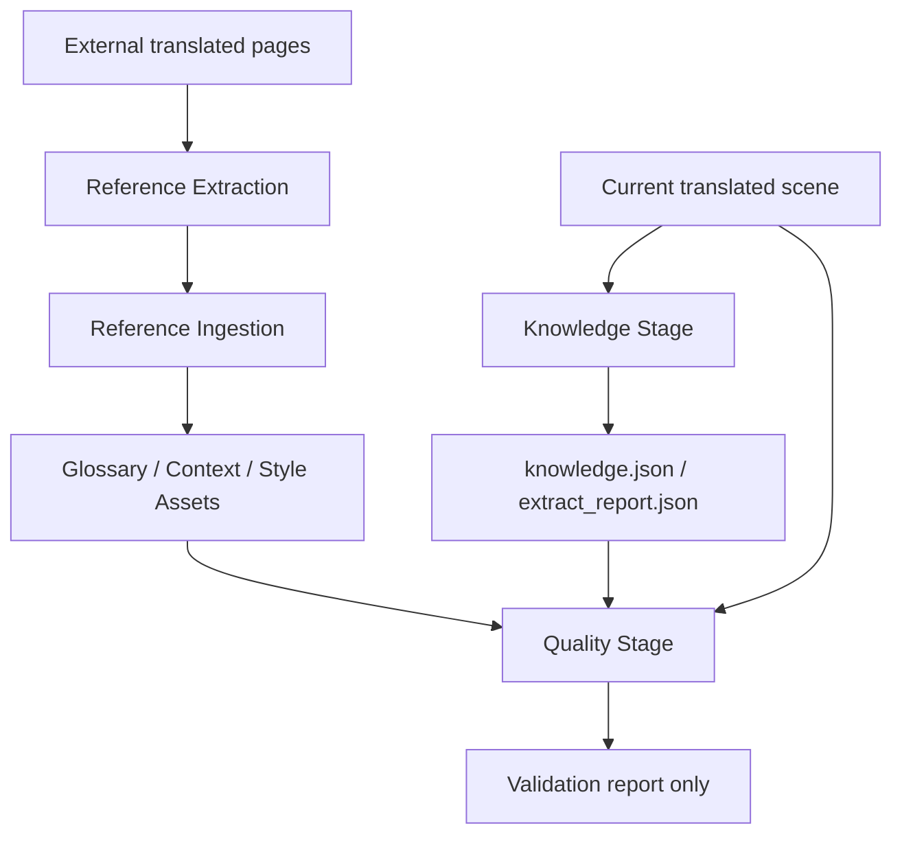
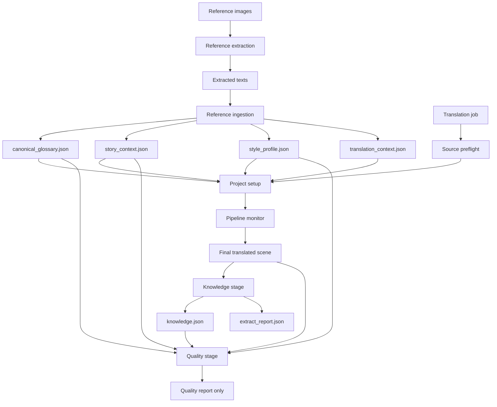
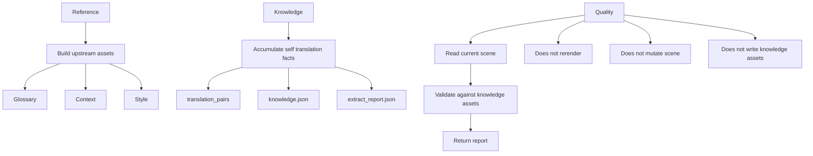

# Quality / Knowledge / Reference Responsibility Spec

## Purpose
This document defines the new target separation for:
- `reference`
- `knowledge`
- `quality`

The goal is to stop these flows from overlapping in responsibility and to make each stage easy to reason about, test, and evolve.

## Current Reality
The current backend has already moved most runtime behavior to the new model, but the repository still contains some legacy comparison-era references:
- `reference extraction` turns external translated pages into extracted text
- `reference ingestion` converts extracted reference text into reusable manga-scoped assets
- `quality` already validates the current translation as a read-only knowledge-driven stage
- some documents and compatibility helpers still refer to comparison-era diagnostics
- `knowledge` stores self-derived translation facts and inferred long-term knowledge in `knowledge.json`

In practice, the repository currently has two knowledge-like outputs:
- **reference-derived translation assets**
  - `canonical_glossary.json`
  - `story_context.json`
  - `style_profile.json`
  - `translation_context.json`
- **self-derived runtime knowledge**
  - `knowledge.json`
  - `extract_report.json`

This spec defines the target contract and the cleanup direction for any remaining legacy edges.

## Reading Guide
This document intentionally separates:
- **Current implementation**
  - what the backend really does today
- **Target model**
  - the desired long-term responsibility split

When these conflict, implementation work should treat the **target model** as the cleanup direction,
while tests and live operation must still respect the **current implementation** until refactors land.

## Target Responsibility Split

### Reference
`reference` is an **upstream input-enrichment flow**.

Its only job is to turn external translated material into reusable project knowledge assets.

`reference` should:
- extract text from externally translated pages
- ingest extracted text into manga-scoped knowledge assets
- enrich translation-time context
- serve as one possible source for knowledge assets

`reference` should not:
- judge the quality of the current translation
- rerender current pages
- directly change current translation output

Primary outputs:
- `knowledge_base/self/<mangaId>/canonical_glossary.json`
- `knowledge_base/self/<mangaId>/story_context.json`
- `knowledge_base/self/<mangaId>/style_profile.json`
- `knowledge_base/self/<mangaId>/translation_context.json`

### Knowledge
`knowledge` is the **long-term internal memory layer** for a manga.

Its job is to accumulate:
- self-derived translation facts
- inferred terminology/character/style patterns
- provenance over time

`knowledge` should:
- read the final translated scene
- extract `translation_pairs`
- merge new chapter/project evidence into manga-scoped memory
- preserve provenance by `mangaId`, `chapterId`, and source project
- optionally enrich with high-level Agent SDK inference

`knowledge` should not:
- act as a quality gate
- compare against external reference sets during validation
- rerender current output

Primary outputs:
- `knowledge_base/self/<mangaId>/knowledge.json`
- `knowledge_base/reports/<mangaId>/extract_report.json`
- `knowledge_base/index.json`

### Quality
`quality` is a **read-only validation stage** for the current translation result.

Its only job is to judge whether the current translation is acceptable **against project knowledge**.

`quality` should:
- read the final translated scene
- validate terminology consistency against `canonical_glossary.json`
- validate contextual consistency against `story_context.json`
- validate tone/style consistency against `style_profile.json`
- validate broader project consistency against `knowledge.json`
- produce a review report, scores, findings, and warnings

`quality` should not:
- apply fixes directly
- rerender pages
- modify scene history
- write knowledge assets
- treat raw reference comparison as its primary contract

Primary outputs:
- quality report object in workflow result
- job-scoped quality artifacts/reports if needed

## Formal Data Flow

## Workflow Sequence Diagram

## Responsibility Boundaries

## Translation Workflow Placement

### Reference flow
Reference work may happen:
- before translation, as separate preparation

Reference flow is always separate and upstream of translation-time memory composition.

### Knowledge flow
Knowledge should run:
- after the translation pipeline has produced the current final scene
- after any optional translation-time work has completed
- before export is considered fully complete, if `knowledge` is enabled

### Quality flow
Quality should run:
- after the translation pipeline has produced the current final scene
- using project knowledge assets as validation criteria
- without mutating the translated scene

## Validation Inputs for Quality
The new quality contract should validate the current translation using:

### Required preferred inputs
- `canonical_glossary.json`
- `style_profile.json`
- `knowledge.json`

### Optional contextual inputs
- `story_context.json`
- `translation_context.json`

### Validation domains
- terminology consistency
- naming consistency
- relationship/context consistency
- style/register consistency
- cross-chapter project consistency

## Quality Output Contract
Quality should return a report-like structure, not a repair instruction set.

Expected output shape:
- `overall`
- `score`
- `totalTranslations`
- `checks`
- `issues`
- `warnings`
- `notes`
- `usedKnowledgeSources`
- compatibility aliases: `passedChecks`, `failedChecks`

It may optionally include:
- `confidence`
- `evidence`
- `artifactPaths`

It should not include:
- direct history mutations
- rerender operation triggers
- inline scene rewrite actions

`checks` is the canonical summary object:
- `checks.passed`
- `checks.failed`
- `checks.totals`

`passedChecks` and `failedChecks` may remain in the payload as compatibility aliases,
but they must mirror `checks.passed` and `checks.failed`.

## Future Repair Stage Placeholder
If the product later reintroduces automatic repair behavior, it must live in a separate `repair` stage.

Required boundaries:
- `quality` remains read-only and produces the validation report only
- `repair`, if implemented, consumes the quality report as input rather than changing the `quality` contract
- `repair` runs after `quality` and before `export`
- `repair` owns any scene mutation, rerender trigger, or fix application behavior
- `repair` must have its own workflow flag, tests, and failure policy

Current state:
- no formal `repair` stage is implemented today
- no runtime path should treat `quality` as an implicit repair stage

## Reference Comparison Policy
Reference comparison is no longer the core definition of quality.

Under the new model:
- reference data may contribute to knowledge assets upstream
- quality validates against normalized project knowledge
- raw `self vs other` comparison is a secondary analysis mode, not the main quality contract

If comparison artifacts are retained:
- they should be treated as optional diagnostics
- they should not define whether quality exists as a stage

### Current implementation note
The runtime quality path is now read-only and knowledge-driven.
That means:
- quality no longer applies direct fixes
- quality no longer triggers rerender
- `quality_validation_report` is now the formal quality-stage artifact

The repository still retains some legacy comparison helpers and historical artifact conventions.
Those should be treated as transitional diagnostics or cleanup residue, not the core quality contract.

## Migration Direction
Implementation should gradually move toward:

1. `reference`
   - remains responsible for building translation-time assets
2. `knowledge`
   - remains responsible for long-term internal memory
3. `quality`
   - becomes read-only and knowledge-driven
4. optional future `repair`
   - if automatic fixes are still desired, they should move into a separate stage

This means future refactors should prefer:
- removing direct fix application from `quality`
- removing rerender triggering from `quality`
- making `knowledge` and `reference` the authoritative sources of validation criteria

## Acceptance Criteria for the New Split
The target model is considered achieved when:
- `reference` only builds knowledge/context assets
- `knowledge` only accumulates self-derived long-term memory
- `quality` only validates current translation quality against knowledge assets
- `quality` no longer mutates the scene or triggers rerender
- translation-time context and quality-time validation both read from normalized project knowledge rather than ad hoc mixed sources

## Implementation Notes
Current implementation still contains transitional behavior, especially in:
- [C:\Users\berserker\Desktop\comics\1\backend\src\modules\quality.js](C:/Users/berserker/Desktop/comics/1/backend/src/modules/quality.js)
- [C:\Users\berserker\Desktop\comics\1\backend\src\modules\knowledge.js](C:/Users/berserker/Desktop/comics/1/backend/src/modules/knowledge.js)
- [C:\Users\berserker\Desktop\comics\1\backend\src\modules\reference_ingestion.js](C:/Users/berserker/Desktop/comics/1/backend/src/modules/reference_ingestion.js)

This spec should be treated as the target contract for future cleanup and stage refactoring.
