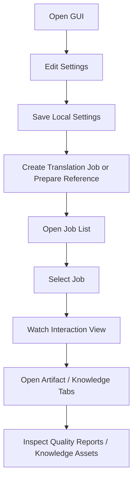

# MangaTranslationAgent SRS

## Goal
MangaTranslationAgent provides a process-trigger backend for Koharu-based manga translation, with a local HTTP API that future CLI and GUI clients can share.

## In Scope
- local backend process
- translation job creation and tracking
- pre-pipeline orchestration
- pipeline monitoring
- optional quality review
- optional knowledge-base update
- reference extraction and reference ingestion
- export and close behavior
- persistence of jobs, events, artifacts, and errors
- provider-based agent runtime integration

## Out of Scope
- Koharu implementation itself
- full GUI editing workstation
- default automatic project deletion
- using prompt-only subagent routing as a production control plane

## Functional Requirements

### FR-01 Backend process
The system must:
- expose a local HTTP API
- accept translation, reference-extraction, and reference-ingestion job requests
- keep job state in local persistence

### FR-02 Pre-pipeline setup
The system must:
- validate the local source folder before translation starts
- detect image files and reject non-image files
- convert unsupported-but-convertible images into supported source images
- support a staged, ordered source-image set before upload
- create a project
- open the project
- upload source pages
- load the default LLM
- resolve engines
- start the pipeline

### FR-03 Pipeline monitoring
The system must:
- monitor the started pipeline operation
- handle fast-finish and late-attach cases
- determine terminal success or failure

### FR-04 Quality review
The system must:
- decide whether to run quality review from config or request override
- read translated text from the scene
- validate the current translation against project knowledge assets
- use canonical glossary, story context, style profile, and accumulated project knowledge when available
- return a structured validation report
- use Agent SDK only for high-level quality judgments
- validate provider results before importing them into workflow state
- not apply fixes, mutate scene history, or trigger rerender as part of `quality`

### FR-04A Future repair stage
If automatic repair is added in the future, the system must:
- implement it as a separate `repair` stage
- run it only after `quality` completes
- keep `quality` as a read-only validation contract
- define an explicit workflow flag and failure policy for `repair`

### FR-05 Knowledge-base update
The system must:
- decide whether to run knowledge update from config or explicit request
- extract translation pairs
- update knowledge-base artifacts
- use Agent SDK only for high-level enrichment judgments
- preserve a clear boundary between fact-layer translation pairs and inferred knowledge
- support v2-compatible knowledge-base metadata, chapter provenance, and inferred knowledge fields
- support manga-scoped knowledge-base storage keyed by `mangaId`
- support user-facing local-style continuation behavior without exposing internal backend stage names as the primary GUI vocabulary

### FR-06 Reference ingestion
The system must:
- promote extracted reference text into manga-scoped translation assets
- support canonical glossary, story context, style profile, and translation context generation
- allow `referenceSetId` and `chapterId` provenance to be preserved when ingesting reference material
- support user-facing reference-style behavior without requiring end users to understand internal backend stage names

### FR-07 Export and close
The system must:
- export supported formats
- close the current project only when close rules are satisfied
- never delete the project by default

### FR-08 Job observation
The system must:
- expose job status reads
- expose job event streaming
- support retry and cancellation
- support deletion of terminal jobs
- support checkbox-based batch deletion of terminal jobs
- support job-list filtering in the GUI for active and historical jobs
- support job-list keyword search in the GUI for common identity and status fields
- support job-list sorting in the GUI for common operator views
- support trash-based delete protection and job restore in the GUI
- support permanent deletion for trashed jobs
- support automatic cleanup of expired trashed jobs

### FR-09 Agent provider integration
The system must:
- support a provider-based agent integration boundary
- support `opencode` as the first provider target
- send only structured task payloads to agent providers
- normalize provider results before they reach workflow modules
- support both managed-runtime SDK mode and heuristic fallback mode under the same contract

### FR-10 Agent workspace isolation
The system must:
- create isolated per-job stage workspaces for agent communication
- keep canonical project storage outside provider-writable areas
- import only validated outputs back into canonical storage
- enforce stage-specific input and output policy rules
- record import and export manifests for provider-facing stages

### FR-11 Source preflight
The system must:
- validate `sourceFolder` before a translation job can start
- confirm read access for the selected source folder
- build a final `source images` set for upload
- preserve a structured report of:
  - discovered files
  - accepted images
  - converted images
  - rejected files

### FR-12 Source ordering
The system must:
- provide a user-confirmable source-image ordering step
- support image preview and drag-drop reorder in the GUI
- rename staged images only when the final order differs from the detected order
- avoid mutating the original source folder as part of ordering

### FR-13 Folder permission handling
The system must:
- validate read access for `sourceFolder`
- validate write access for `outputFolder`
- detect when required folder access is missing
- provide a GUI remediation path so the user can re-select a folder or retry access checks

## Non-Functional Requirements
- config precedence: HTTP request overrides > `koharu.json` > backend defaults
- any workflow failure stops remaining downstream stages
- backend returns structured status and error data
- `QQ` remains an outer agent response policy, not a backend payload
- persistence uses local SQLite
- external agent sessions must not get unrestricted write access to repo root
- invalid agent result schemas must fail the current stage before import

## Workflow Requirements
- the official runtime entrypoint is `backend/server.js`
- translation jobs must complete source preflight before project setup begins
- `translationMode` is required and is the only translation capability policy switch
- `quick` loads no memory; `learning_style` always runs Quality and schedules Knowledge
- Translation never executes Reference Ingestion; Reference assets must already be ready
- Quality completes before final snapshot and Export
- Knowledge runs as a non-blocking child from the final snapshot after Export

The GUI presents four explicit modes: `quick`, `reference_style`, `local_style`, and `learning_style`.

Current implementation note:
- some runtime behavior still reflects an older comparison-oriented quality model
- the target product model is:
  - `reference` as upstream style/context input
  - `knowledge` as long-term local style memory
  - `quality` as read-only consistency validation

## Close and Delete Definitions
- `close project`: `DELETE /projects/current`
- `delete project`: remove stored project data
- default workflow allows close only, not delete

## Migration Requirement
- legacy `.opencode/skills/*`, `.opencode/agents/*`, and `.opencode/opencode.json` may remain temporarily as migration references
- they are not the official production control plane

## Reference Asset Requirement
The system must support this directory structure for comparison-based quality review:
- `references/other_images/<reference_set_id>/`
- `references/extracted/<reference_set_id>/`
- `references/comparisons/<reference_set_id>/` (legacy diagnostics only)
- `references/manifests/<reference_set_id>.json`

The `references/comparisons/` subtree remains compatibility-only and must not be treated as a required quality-stage dependency.

## Knowledge Base Requirement
The system must support:
- `knowledge_base/index.json`
- `knowledge_base/self/<mangaId>/knowledge.json` as the primary manga-scoped runtime knowledge artifact
- `knowledge_base/reports/<mangaId>/extract_report.json` as the primary manga-scoped runtime report artifact
- `knowledge_base/self/my-manga.json` as a legacy fallback artifact when no `mangaId` is provided
- `knowledge_base/self/my-manga.schema.example.json` as the v2 target contract reference
- `knowledge_base/reports/migration_plan_v2.md` as the upgrade reference
- manga-scoped `canonical_glossary.json`
- manga-scoped `story_context.json`
- manga-scoped `style_profile.json`
- manga-scoped `translation_context.json`

## Agent Runtime Requirement
The system must support:
- isolated per-job stage workspaces under `cache/workspaces/<jobId>/<stage>/`
- allowed input-key and source-path policy enforcement
- allowed output and artifact file-name policy enforcement
- `artifacts/import_manifest.json` for materialized input auditing
- `artifacts/export_manifest.json` for accepted and rejected output auditing

## User Stories

### US-01 First-time setup
As a user,
I want to open the GUI and configure folders, Koharu, and LLM settings,
so that future jobs use my local environment without editing JSON by hand.

Expected GUI flow:
1. Open the desktop GUI
2. Let Electron auto-start backend, or connect to an existing backend
3. Open `Settings`
4. Fill:
   - output folder
   - optional reference folder
   - opencode runtime mode and connection fields
   - quality LLM fields
   - translation LLM fields
   - Koharu base URL
   - pipeline engine values
5. Save settings

Expected result:
- settings are written to the local GUI settings file
- reloading the UI keeps the same settings
- future jobs inherit these settings
- current running jobs are not affected by later changes

Acceptance route:
- primary e2e IDs:
  - `E2E-BLK-START-001`
  - `E2E-IMP-START-002`
- primary manual checklist sections:
  - `A. Startup`
  - `B. Settings`

### US-02 Start a normal translation job
As a user,
I want to create a translation job with simple, human-readable names,
so that I do not have to think about internal IDs.

Clarified v1 frontend inputs:
- `translationMode`
  - required
  - one of `敹恍€蕃霅畔 / `?€◢?潛蕃霅畔 / `?砍憸冽蝧餉陌` / `摮貊?憸冽蝧餉陌`
- `sourceFolder`
  - required
  - chosen from the local filesystem
- `mangaLabel`
  - required
  - selected from an existing manga list, or entered through an inline `Create new manga` field
- `chapterLabel`
  - optional
  - free-text user label
- `reference material`
  - shown only for reference-based modes
  - selected from an existing reference set list
- `glossaryMode`
  - user-facing label: `參考術語策略`
  - shown only for reference-based modes
  - `canonical` / `reference_only` / `disabled`
- `quality validation`
  - shown only for modes where it is optional
  - always on for `摮貊?憸冽蝧餉陌`

Clarified v1 system-managed identifiers:
- `mangaId`
- `chapterId`
- `referenceSetId`

Clarified v1 frontend flow:
1. Open `Job`
2. Choose a translation mode
3. Enter:
   - source folder
   - manga title
   - optional chapter title
4. If the chosen mode uses reference style, select:
   - reference material
   - reference glossary strategy
   - optional quality validation when the mode allows it
5. Click `Validate`
6. Let the GUI validate:
   - the source folder exists
   - the source folder is readable
   - the output folder from `Settings` is writable
7. Review the detected source images
8. Reorder images if needed
9. Review system-managed identifiers
10. Click `Start translation`
11. Open `Job List`
12. Inspect the selected job detail workspace

Authoritative note:
- the clarified v1 frontend inputs and flow above are the current source of truth for GUI behavior
- any older wording below should be treated as legacy wording if it conflicts

Expected GUI flow:
1. Open `Jobs`
2. Enter:
   - source folder
   - manga title
   - optional chapter title
3. Choose a translation mode:
   - `敹恍€蕃霅畔
   - `?€◢?潛蕃霅畔
   - `?砍憸冽蝧餉陌`
   - `摮貊?憸冽蝧餉陌`
4. Let the GUI validate:
   - the source folder exists
   - the source folder is readable
   - the output folder from `Settings` is writable
5. Review the detected source images
6. Reorder images if needed
7. Review system-generated identifiers
8. Click `Start translation`
9. Open `Job List`
10. Inspect the selected job detail workspace

Expected result:
- backend creates a translation job
- source files are validated before upload
- unsupported-but-convertible images are converted into a supported staged image set
- user-confirmed ordering becomes the upload order when it changed
- the workflow proceeds through project setup, pipeline, optional style learning, optional consistency validation, export, and close
- the GUI shows job status, stage, payload, result, error state, and job-scoped artifacts from the selected-job workspace
- the user can later find the job in `Job List`, filter it by state, and remove it after completion if it is no longer needed

Acceptance route:
- primary e2e IDs:
  - `E2E-BLK-TRAN-001`
  - `E2E-BLK-TRAN-002`
  - `E2E-BLK-SYNC-001`
  - `E2E-BLK-SYNC-002`
- primary manual checklist sections:
  - `C. Job Creation`
  - `D. Job List Workspace`
  - `E. Job Detail Overview`
  - `F. What To Expect In Workflow / Engines / Page Progress`

### US-03 Translate with reference style
As a user,
I want to translate with the style of another translated chapter,
so that terminology and tone become more consistent without learning internal backend terms.

Clarified v1 frontend inputs across this flow:
- reference extraction job:
  - `reference material`
    - required
    - selected from an existing reference set list
  - `targetLanguage`
    - optional override
  - `translator`
    - optional
- reference ingestion job:
  - `reference material`
    - required
    - selected from the same reference set list
  - `mangaLabel`
    - required
    - selected from an existing manga list, or entered through an inline `Create new manga` field
  - `chapterLabel`
    - optional
  - `glossaryMode`（參考術語策略）
    - optional
  - `translator`
    - optional
- translation job:
  - `translationMode`
    - `reference_style` or `learning_style`
  - `sourceFolder`
    - required
  - `mangaLabel`
    - required
  - `chapterLabel`
    - optional
  - `reference material`
    - required
    - selected from the same reference set list
  - `glossaryMode`（參考術語策略）
    - optional

Clarified v1 system-managed identifiers in this flow:
- `referenceSetId`
- `mangaId`
- `chapterId`

Clarified v1 frontend flow:
1. Prepare the reference set before using the GUI:
   - `references/manifests/<referenceSetId>.json`
   - `references/other_images/<referenceSetId>/`
2. Open `Reference`
3. In `Prepare reference material`, select one existing reference set
4. Start reference extraction
5. Review OCR / extracted outputs in the same `Reference` workspace:
   - preview extracted scene JSON
   - preview extracted OCR text JSON
   - edit JSON when OCR cleanup is needed
   - delete extracted JSON when the extraction output must be regenerated
6. Enter ingestion inputs for the same reference set:
   - manga title
   - optional chapter title
   - optional reference glossary strategy
7. Start reference ingestion
8. Review ingestion reports in the same `Reference` workspace:
   - canonical glossary
   - story context
   - style profile
   - translation context
9. Open `Job`
10. Choose `reference_style` or `learning_style`
11. Enter:
   - source folder
   - the same manga title
   - optional chapter title
12. Select:
   - the same reference material
   - reference glossary strategy
   - optional quality validation when the chosen mode allows it
13. Click `Validate`
14. Review source images and reorder if needed
15. Start translation
16. Open `Job List`
17. Select the relevant job and inspect its artifact and knowledge tabs

Authoritative note:
- the clarified v1 frontend inputs and flow above are the current source of truth for GUI behavior
- reference preparation belongs to the dedicated `Reference` page rather than the `Job` page
- OCR / extracted text review, edit, and delete actions also belong to the `Reference` page
- ingestion reports are also shown from the `Reference` page before the user returns to translation creation

Expected GUI flow:
1. Put reference images under `references/other_images/<reference_set_id>/`
2. Open `Reference`
3. Run a `reference extraction` job by selecting an existing reference set
4. Inspect OCR / extracted outputs and edit or delete them if needed
5. Run a `reference ingestion` job for a manga title and optional chapter title
6. Review ingestion reports in the same `Reference` page
7. Open `Job`
8. Create a translation job in `reference_style` or `learning_style` mode with:
   - the same manga title
   - the translator binding whose Reference Ingestion is complete
   - an optional source chapter override when automatic matching is incorrect
9. Open `Job List`
10. Select the relevant job and inspect its artifact tab

Expected result:
- backend creates extracted reference text
- GUI lets the operator query, edit, or delete OCR / extracted outputs before ingestion
- backend ingests reference data into canonical glossary, story context, style profile, and translation context
- GUI shows ingestion-side reports on the `Reference` page
- reference-derived assets influence translation-time context
- GUI shows quality validation reports, and may still surface legacy diagnostics from the selected-job workspace

Acceptance route:
- primary e2e IDs:
  - `E2E-BLK-REF-001`
  - `E2E-BLK-REF-002`
  - `E2E-IMP-REF-003`
- primary manual checklist sections:
  - `J. Reference / Knowledge Tab`
  - `K. Artifacts Tab`

### US-04 Observe long-running work
As a user,
I want to watch backend, Koharu, agent, and LLM interactions in one place,
so that I can understand what the system is doing without reading raw logs.

Expected GUI flow:
1. Open `Job List`
2. Select a job
3. Watch `Interaction View`
4. Scroll upward to inspect older entries
5. Use `Jump to Latest` when ready
6. Filter by:
   - backend
   - koharu
   - agent
   - llm
   - request
   - response
   - internal
   - error

Expected result:
- historical events load first
- live events append through stream updates
- scrolling up pauses auto-follow
- unread count increases while follow is paused
- `Jump to Latest` returns to the newest events

Acceptance route:
- primary e2e IDs:
  - `E2E-BLK-SYNC-002`
  - `E2E-IMP-SYNC-004`
- primary manual checklist sections:
  - `L. Raw Events Live Interaction`

### US-05 Resume after refresh or reopen
As a user,
I want the GUI to recover my context after refresh or reopen,
so that a running backend job is not lost when the UI is interrupted.

Expected GUI flow:
1. Start a job
2. Navigate between `Job`, `Job List`, and the selected-job detail tabs
3. Refresh or reopen the GUI

Expected result:
- backend keeps running
- settings are reloaded from disk
- last selected page is restored
- last selected job is restored
- selected manga context is restored
- event history is rebuilt from backend snapshot plus stream

Acceptance route:
- primary e2e IDs:
  - `E2E-IMP-FAIL-005`
  - `E2E-IMP-START-002`
- primary manual checklist sections:
  - `M. Persistence`
  - `N. Backend Separation`

### US-07 Manage finished jobs
As a user,
I want to remove finished jobs from the list one by one or in batches,
so that the job workspace stays readable over time.

Expected GUI flow:
1. Open `Job List`
2. Filter to `Completed` or `Failed`
3. Optionally search by title, id, or status to narrow the list
4. Optionally change sorting, for example:
   - latest updated first
   - newest created first
   - status priority
   - manga title
5. Select one or more terminal jobs with checkboxes
6. Use `Delete` or `Delete selected`
7. Confirm the deletion prompt
8. If needed, use `Undo` immediately or switch to `Trash` and restore the job later
9. If the user really wants to remove it forever, permanently delete it from `Trash`

Expected result:
- active jobs cannot be deleted
- terminal jobs move to Trash instead of being immediately hard-deleted
- trashed jobs can be restored from `Undo` or the `Trash` view
- trashed jobs can be permanently deleted when the user explicitly confirms it
- deleting the currently selected terminal job clears the selected-job workspace
- the list refreshes without requiring a full GUI restart
- search and filter can be combined so large histories remain manageable
- sorting helps operators bring the most relevant jobs to the top

Acceptance route:
- primary e2e IDs:
  - `E2E-BLK-JOBS-001`
  - `E2E-BLK-JOBS-002`
  - `E2E-BLK-JOBS-003`
  - `E2E-BLK-JOBS-004`
  - `E2E-BLK-JOBS-005`
  - `E2E-IMP-JOBS-006`
  - `E2E-IMP-JOBS-007`
- primary manual checklist sections:
  - `D. Job List Workspace`
  - `G. Delete -> Undo`
  - `H. Trash -> Restore`
  - `I. Trash -> Delete Forever`

### US-06 Review outputs and knowledge assets
As a user,
I want one place to inspect quality validation outputs, manifests, glossary, story context, and style profile,
so that I can understand what the process and agent runtime produced.

Expected GUI flow:
1. Open `Job List`
2. Select a job
3. Open the `Artifacts` detail tab
4. Preview:
   - quality validation report
   - legacy diagnostic report when present
   - workspace import manifest
   - workspace export manifest
5. Inspect:
   - canonical glossary
   - story context
   - style profile

Expected result:
- GUI shows human-readable summary cards before raw JSON
- files can still be opened externally
- manga-scoped knowledge assets are available from the selected-job detail workspace without leaving the job context

Acceptance route:
- primary e2e IDs:
  - `E2E-IMP-REF-003`
- primary manual checklist sections:
  - `K. Artifacts Tab`

## User Journey Overview

## GUI + Backend Completeness Review

### Completed for v1
- Electron can manage backend startup for normal desktop usage
- local settings are editable in the GUI and persist to disk
- path validation is available before saving settings
- translation jobs can be created from user-facing labels while internal IDs remain system-managed
- reference extraction and reference ingestion workflows are available from the dedicated `Reference` page
- extraction artifacts can be queried, edited, and deleted from the GUI
- ingestion artifacts can be previewed from the GUI
- job list, job detail, retry, cancel, terminal-job delete, and batch delete are available
- job list supports `All / Active / Completed / Failed` filtering
- job list supports keyword search across common job identity fields
- job list supports user-controlled sorting for common operator views
- job list supports trash-based delete protection with restore and undo
- interaction view supports:
  - snapshot hydration
  - live stream append
  - deduplication
  - auto-follow pause and resume
  - unread tracking
  - source and direction filters
- selected-job artifact tabs support:
  - quality validation reports
  - workspace manifests
  - other job artifacts
  - preview and external open
  - glossary, story context, and style profile inspection
- backend already exposes the GUI-facing APIs required by v1
- release-facing e2e inventory is now split into:
  - automated backend/API/agent/runtime coverage
  - manual GUI smoke coverage
  - hybrid SSE-first sync validation

### Intentionally deferred from v1
- full glossary editor
- style-profile editor
- visual diff editor
- rich manga library management UI
- multi-window coordination

### Current completeness judgment
The current `GUI + backend` implementation is functionally complete for the declared v1 scope when measured against:
- settings management
- job creation
- job list
- job detail
- interaction view
- artifact links and previews
- start / stop / retry controls

The main remaining work is no longer missing core v1 capability, but:
- polish
- broader manual smoke coverage
- possible UX refinement for non-technical users
- source preflight, image ordering, and permission-remediation implementation
