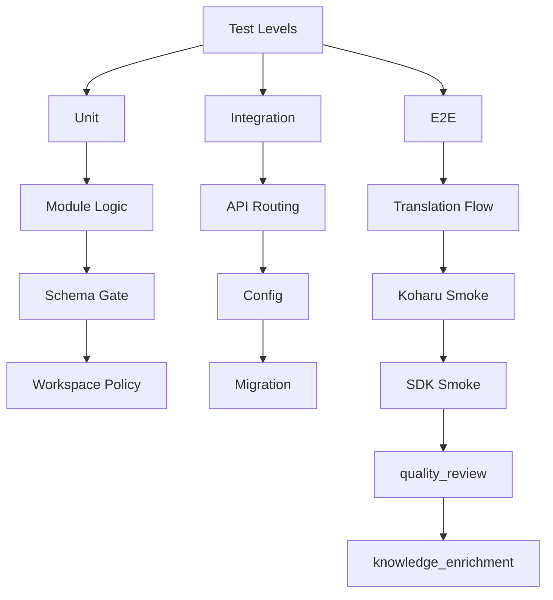
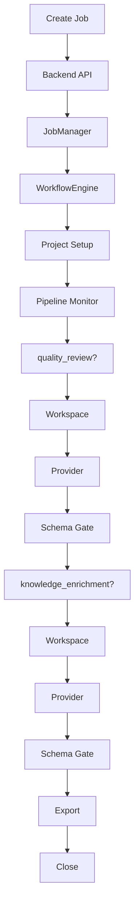

# MangaTranslationAgent STD

## Purpose
This Software Test Description defines the current test scope, test levels, execution strategy, and requirement coverage for MangaTranslationAgent.

It is aligned with:
- [C:\Users\berserker\Desktop\comics\1\docs\SRS.md](C:/Users/berserker/Desktop/comics/1/docs/SRS.md)
- [C:\Users\berserker\Desktop\comics\1\docs\ARCHITECTURE.md](C:/Users/berserker/Desktop/comics/1/docs/ARCHITECTURE.md)
- [C:\Users\berserker\Desktop\comics\1\docs\WORKFLOW.md](C:/Users/berserker/Desktop/comics/1/docs/WORKFLOW.md)
- [C:\Users\berserker\Desktop\comics\1\docs\E2E_MATRIX.md](C:/Users/berserker/Desktop/comics/1/docs/E2E_MATRIX.md)

## E2E Acceptance Model
This project now treats e2e acceptance as a mixed local-environment program:
- automated backend/API/agent/runtime validation
- manual GUI validation
- hybrid checks where backend correctness is automated but final desktop behavior is still visually verified

Gate levels:
- `Blocker`
  - must pass before release acceptance
- `Important`
  - should pass for a stable desktop build
- `Optional`
  - confidence and polish coverage

Execution modes:
- `Automated`
- `Manual`
- `Hybrid`

The detailed check inventory lives in:
- [C:\Users\berserker\Desktop\comics\1\docs\E2E_MATRIX.md](C:/Users/berserker/Desktop/comics/1/docs/E2E_MATRIX.md)

## Test Architecture Diagram


## Test Scope
The current test program covers:
- backend HTTP API behavior
- workflow orchestration
- pipeline monitoring and recovery behavior
- reference extraction and ingestion logic
- quality review flow
- knowledge-base update flow
- agent provider integration
- agent workspace isolation and manifest auditing
- legacy migration script safety

The current test program does not fully cover:
- real user-provided `other` reference comparison live flow
- full GUI behavior
- manual editing workflows outside the backend API

Release-facing e2e groups are organized as:
- `Startup & Runtime`
- `Translation Success Path`
- `Job Observation & Sync`
- `Reference / Knowledge`
- `Job Management`
- `Core Failure Paths`

## Test Levels

### Unit
Purpose:
- validate isolated module behavior
- validate schema guards and workspace policy
- validate data normalization and path resolution

Primary unit targets:
- `backend/src/config.js`
- `backend/src/workflow_engine.js`
- `backend/src/modules/reference_sets.js`
- `backend/src/modules/reference_ingestion.js`
- `backend/src/modules/quality.js`
- `backend/src/modules/knowledge.js`
- `backend/src/modules/knowledge_paths.js`
- `backend/src/modules/knowledge_assets.js`
- `backend/src/ao_client.js`
- `backend/src/ao_assets.js`
- `backend/src/ao_tasks.js`
- `backend/src/ao_contracts.js`
- legacy migration scripts that still remain under `.opencode/`

### Integration
Purpose:
- validate backend API routing
- validate config resolution
- validate migration-era compatibility boundaries

Primary integration targets:
- `POST /jobs/translation`
- `GET /jobs/:jobId`
- config override behavior from `.opencode/koharu.json`
- script presence/loadability during transition

### E2E
Purpose:
- validate full backend job behavior across stages
- validate runtime state transitions
- validate live or SDK-backed boundaries
- provide the automated half of the mixed local-environment release gate

Primary e2e targets:
- translation job orchestration
- cancel / retry / stream behavior
- live backend smoke against Koharu
- opencode SDK managed-runtime smoke
- agent-in-the-loop quality and knowledge stages

## Test Environment

### Runtime Assumptions
- OS: Windows
- shell: PowerShell
- Node.js available
- local filesystem writable
- local network access available

### Backend Dependencies
- `backend/package.json`
- `@opencode-ai/sdk`
- `opencode-ai`
- local SQLite via Node runtime

### External Dependencies
- Koharu runtime for live smoke and pipeline-related e2e tests
- local `opencode` binary in `backend/node_modules/.bin` for managed SDK smoke

## Test Artifacts
The test program may create or inspect:
- `cache/workspaces/<jobId>/<stage>/`
- `cache/process-agent.sqlite`
- `references/extracted/<referenceSetId>/`
- `references/comparisons/<referenceSetId>/` (legacy diagnostics only)
- `knowledge_base/self/<mangaId>/`
- `knowledge_base/reports/<mangaId>/`

The `references/comparisons/` subtree remains compatibility-only and should be treated as transitional diagnostics, not a required runtime dependency.

Agent-stage audit artifacts explicitly covered:
- `artifacts/import_manifest.json`
- `artifacts/export_manifest.json`

## Test Suites

### Unit Suites
- [C:\Users\berserker\Desktop\comics\1\tests\unit\config.test.js](C:/Users/berserker/Desktop/comics/1/tests/unit/config.test.js)
- [C:\Users\berserker\Desktop\comics\1\tests\unit\api.test.js](C:/Users/berserker/Desktop/comics/1/tests/unit/api.test.js)
- [C:\Users\berserker\Desktop\comics\1\tests\unit\process_runtime.test.js](C:/Users/berserker/Desktop/comics/1/tests/unit/process_runtime.test.js)
- [C:\Users\berserker\Desktop\comics\1\tests\unit\reference_sets.test.js](C:/Users/berserker/Desktop/comics/1/tests/unit/reference_sets.test.js)
- [C:\Users\berserker\Desktop\comics\1\tests\unit\reference_ingestion.test.js](C:/Users/berserker/Desktop/comics/1/tests/unit/reference_ingestion.test.js)
- [C:\Users\berserker\Desktop\comics\1\tests\unit\reference_image_conversion.test.js](C:/Users/berserker/Desktop/comics/1/tests/unit/reference_image_conversion.test.js)
- [C:\Users\berserker\Desktop\comics\1\tests\unit\quality_reference_flow.test.js](C:/Users/berserker/Desktop/comics/1/tests/unit/quality_reference_flow.test.js)
- [C:\Users\berserker\Desktop\comics\1\tests\unit\knowledge_module.test.js](C:/Users/berserker/Desktop/comics/1/tests/unit/knowledge_module.test.js)
- [C:\Users\berserker\Desktop\comics\1\tests\unit\knowledge_paths.test.js](C:/Users/berserker/Desktop/comics/1/tests/unit/knowledge_paths.test.js)
- [C:\Users\berserker\Desktop\comics\1\tests\unit\knowledge_assets.test.js](C:/Users/berserker/Desktop/comics/1/tests/unit/knowledge_assets.test.js)
- [C:\Users\berserker\Desktop\comics\1\tests\unit\ao_client.test.js](C:/Users/berserker/Desktop/comics/1/tests/unit/ao_client.test.js)
- [C:\Users\berserker\Desktop\comics\1\tests\unit\ao_assets.test.js](C:/Users/berserker/Desktop/comics/1/tests/unit/ao_assets.test.js)
- [C:\Users\berserker\Desktop\comics\1\tests\unit\one_click_translate.test.js](C:/Users/berserker/Desktop/comics/1/tests/unit/one_click_translate.test.js)
- [C:\Users\berserker\Desktop\comics\1\tests\unit\listen_events.test.js](C:/Users/berserker/Desktop/comics/1/tests/unit/listen_events.test.js)
- [C:\Users\berserker\Desktop\comics\1\tests\unit\workflow_contracts.test.js](C:/Users/berserker/Desktop/comics/1/tests/unit/workflow_contracts.test.js)

### Integration Suites
- [C:\Users\berserker\Desktop\comics\1\tests\integration\backend_api.test.js](C:/Users/berserker/Desktop/comics/1/tests/integration/backend_api.test.js)
- [C:\Users\berserker\Desktop\comics\1\tests\integration\config_override.test.js](C:/Users/berserker/Desktop/comics/1/tests/integration/config_override.test.js)
- [C:\Users\berserker\Desktop\comics\1\tests\integration\script_load.test.js](C:/Users/berserker/Desktop/comics/1/tests/integration/script_load.test.js)

### E2E Suites
- [C:\Users\berserker\Desktop\comics\1\tests\e2e\backend_job_flow.test.js](C:/Users/berserker/Desktop/comics/1/tests/e2e/backend_job_flow.test.js)
- [C:\Users\berserker\Desktop\comics\1\tests\e2e\pipeline.test.js](C:/Users/berserker/Desktop/comics/1/tests/e2e/pipeline.test.js)
- [C:\Users\berserker\Desktop\comics\1\tests\e2e\live_backend_smoke.test.js](C:/Users/berserker/Desktop/comics/1/tests/e2e/live_backend_smoke.test.js)
- [C:\Users\berserker\Desktop\comics\1\tests\e2e\knowledge_base.test.js](C:/Users/berserker/Desktop/comics/1/tests/e2e/knowledge_base.test.js)

## Test Design by Functional Area

## Execution Flow Diagram


### Translation Workflow
Covered by:
- `process_runtime.test.js`
- `backend_api.test.js`
- `backend_job_flow.test.js`
- `live_backend_smoke.test.js`

Validated behaviors:
- translation jobs can be created
- translation happy-path e2e now follows the official `sourcePreflightId -> translation` entry path
- source preflight resolution and source-preflight manifest creation are exercised before translation execution
- setup, pipeline monitoring, export, and close are sequenced correctly
- failure stops downstream stages

### Quality Workflow
Covered by:
- `quality_reference_flow.test.js`
- `backend_job_flow.test.js`

Validated behaviors:
- quality gating
- knowledge-driven validation support
- glossary/style compliance logic
- current agent e2e baseline reaches quality assertions through the official preflight-aware translation path
- SDK-backed quality review success and schema rejection
- quality no longer mutates scene history or triggers rerender
- quality now returns a validation report shape instead of fix instructions

Current implementation vs target model:
- automated coverage still includes some legacy diagnostic helpers where they remain in the repository
- long-term acceptance direction is read-only quality validation against normalized project knowledge

### Knowledge Workflow
Covered by:
- `knowledge_module.test.js`
- `knowledge_paths.test.js`
- `knowledge_assets.test.js`
- `backend_job_flow.test.js`
- `knowledge_base.test.js`

Validated behaviors:
- manga-scoped knowledge paths
- chapter provenance
- v2-compatible knowledge metadata
- current backend e2e baseline reaches knowledge assertions through the official preflight-aware translation path

### Reference Workflow
Covered by:
- `reference_sets.test.js`
- `reference_ingestion.test.js`
- `reference_image_conversion.test.js`
- `backend_job_flow.test.js`

Validated behaviors:
- manifest handling
- extracted text normalization
- reference ingestion into glossary/context/style assets
- unsupported image conversion support

Current implementation vs target model:
- current implementation may still retain historical comparison artifacts or helpers in the repository
- target direction is to treat reference primarily as an upstream asset-building flow rather than the core definition of quality

### Agent Runtime Workflow
Covered by:
- `ao_client.test.js`
- `ao_assets.test.js`
- `backend_job_flow.test.js`

Validated behaviors:
- AO HTTP conversation initialization
- ready polling gate before messaging
- AO task prompt construction
- result schema validation
- backend-owned artifact manifests

## Requirement Coverage Matrix

### FR-01 Backend process
Covered by:
- `backend_api.test.js`
- `backend_job_flow.test.js`

### FR-02 Pre-pipeline setup
Covered by:
- `one_click_translate.test.js`
- `backend_api.test.js`
- `backend_job_flow.test.js`
- `live_backend_smoke.test.js`

### FR-03 Pipeline monitoring
Covered by:
- `listen_events.test.js`
- `pipeline.test.js`
- `backend_job_flow.test.js`
- `live_backend_smoke.test.js`

### FR-04 Quality review
Covered by:
- `quality_reference_flow.test.js`
- `backend_job_flow.test.js`

### FR-05 Knowledge-base update
Covered by:
- `knowledge_module.test.js`
- `knowledge_base.test.js`
- `backend_job_flow.test.js`

### FR-06 Reference ingestion
Covered by:
- `reference_ingestion.test.js`
- `backend_job_flow.test.js`

### FR-07 Job observation
Covered by:
- `backend_api.test.js`
- `backend_job_flow.test.js`

### FR-08 Agent provider integration
Covered by:
- `ao_client.test.js`
- `ao_assets.test.js`
- `backend_job_flow.test.js`

### FR-09 Agent workspace isolation
Covered by:
- `ao_assets.test.js`
- `backend_job_flow.test.js`

### FR-10 Agent workspace isolation manifests and policy
Covered by:
- `ao_assets.test.js`
- `backend_job_flow.test.js`

## E2E Gate Summary

### Blocker
- GUI managed startup + backend ready
- translation happy path from `Job` to successful export
- `Job List` and `Job Detail` SSE-first sync
- workflow / engine / page progress correctness
- terminal-job trash, undo, restore, and delete-forever safety
- reference and knowledge happy path when enabled
- pipeline / quality / knowledge / export failure stop policy

### Important
- pane collapse / expand / resize behavior
- raw events live interaction
- reconnect -> fallback polling -> recover
- keyword search / filter / sort
- artifacts preview and manifests
- external backend separation

### Optional
- deeper RWD polish checks
- visual consistency refinements
- multi-chapter / multi-manga exploratory scenarios
- prolonged soak-style live monitoring

## Mixed Coverage Strategy
- backend/API/agent/reference/runtime correctness is primarily validated through automated suites
- GUI interaction, drag-reorder, badge transitions, pane behavior, and raw-event readability remain primarily manual
- SSE-first list/detail sync is treated as hybrid:
  - stream endpoints and progress payloads are covered automatically
  - final desktop behavior is verified with the GUI smoke checklist

## Current High-Value Baseline
The currently revalidated high-value local baseline is:
- `tests/integration/backend_api.test.js`
- `tests/e2e/backend_job_flow.test.js`
- `tests/unit/ao_client.test.js`
- `tests/unit/ao_assets.test.js`
- `gui` `typecheck`
- `gui` `build`

This baseline reflects the current official workflow, including the mandatory source preflight step before translation job creation.

## Entry Criteria
- Node.js is available
- repo dependencies are installed
- `tests/node_modules/` is available
- `backend/node_modules/` is available for SDK tests
- Koharu is available for live smoke suites that require it

## Exit Criteria
- no failing unit tests in changed areas
- no failing integration tests in changed areas
- no failing e2e tests in changed areas
- documented known gaps remain explicitly listed

## Known Gaps
- no full live legacy comparison e2e with user-provided `other` reference images is bundled by default
- GUI-level interaction is still not covered by desktop automation
- manual operator workflows outside backend APIs are not covered by Jest
- SSE-first desktop UX is specified and manually testable, but not fully machine-asserted in the renderer

## Execution Commands
```bash
npm test --prefix tests
npm run test:unit --prefix tests
npm run test:integration --prefix tests
npm run test:e2e --prefix tests
npm run test:coverage --prefix tests
```
